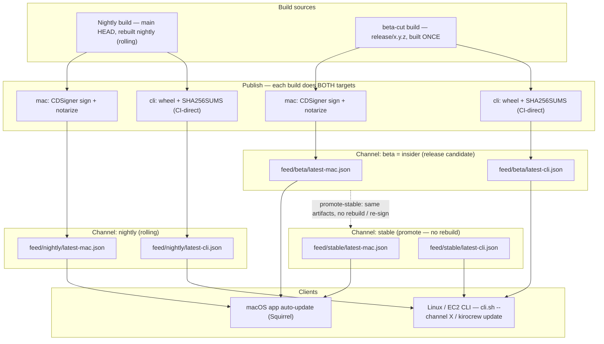

# KiroCrew Release Automation

Design for the three-channel release pipeline: Nightly → Beta → Stable.

## As built (authoritative, 2026-07-21)

The sections below this one are the original design; the implementation
deliberately diverged in several places. Where they disagree, THIS section
is the contract.

**Channels and triggers (as built):**

| Channel | Trigger | Workflow |
|---------|---------|----------|
| nightly | schedule (06:00 UTC) + manual dispatch on `main` | `nightly.yml` |
| insider | push of a prerelease tag (`v0.2.0-insider.1`, `-rc.N`, …) | `release.yml` |
| stable  | push of a bare semver tag (`v0.2.0`) | `release.yml` |

There is no release-branch / beta-cut / promote model and no
`beta-hotfix.yml`, `promote-stable.yml`, or `rollback.yml`. Channel is
derived from the tag; versions are stamped with seconds precision on
nightly (`0.1.0-nightly.YYYYMMDDHHMMSS`) so no published key is ever
overwritten.

**Buckets (as built) — two, not one:**

- `kirocrew-signing-artifacts-…` (PRIVATE, signing trust domain only):
  `pre-signed/` → `signed/` (CDSigner output) → `notarized/` (archive)
- `kirocrew-updates-…` (private + CloudFront OAC, public trust domain):
  `cli/{channel}/{version}/`, `desktop/{channel}/{version}/`,
  `feed/{channel}/latest-mac.json`, served at
  `https://d28nxu9if70cmc.cloudfront.net` (`updates.kirocrew.dev` is not
  yet provisioned)

**Feed (as built) — static file, no Lambda:** `sign-and-notarize.yml` writes
`feed/{channel}/latest-mac.json` directly after the spctl gate. There is no
Feed Lambda, no S3-event trigger, no 200/204 endpoint, and no CloudFront
Function query routing: the client (`auto-update.js`) fetches the static
JSON and compares versions CLIENT-SIDE, engaging Squirrel only on a version
delta. Schema:

```json
{
  "version": "0.1.0-nightly.20260721061155",
  "url": "https://d28nxu9if70cmc.cloudfront.net/desktop/nightly/0.1.0-nightly.20260721061155/KiroCrew.zip",
  "dmg": "https://d28nxu9if70cmc.cloudfront.net/desktop/nightly/0.1.0-nightly.20260721061155/KiroCrew.dmg",
  "name": "0.1.0-nightly.20260721061155",
  "pub_date": "2026-07-21T06:22:13Z"
}
```

`url` is the Squirrel auto-update payload (zip, mandatory). `dmg` is the
first-install disk image for humans/website links; Squirrel ignores it.

**macOS artifact flow (as built), all channels via `sign-and-notarize.yml`** (which folds the CDSigner sign job and the notarize job into one reusable workflow shared by `nightly.yml` and `release.yml`; the trigger files carry only version derivation and `uses:` calls)**:**

1. CDSigner signs the .app (dynamic manifest covering every nested Mach-O)
2. `notarytool` submit (app) → staple → `spctl` fail-closed gate
3. Notarized zip → `notarized/` (signing bucket) + `desktop/{channel}/{version}/`
   (distribution bucket, conditional write, immutable cache)
4. **DMG rebuilt from the STAPLED app** (`hdiutil`, /Applications symlink) —
   the electron-builder DMG wraps the unsigned app and never ships anywhere.
   The rebuilt DMG is provenance-attested, then notarized (Apple accepts an
   unsigned DMG whose contents are signed+stapled; stapling the DMG itself
   requires a code signature and is skipped — the DMG passes Gatekeeper via
   the online ticket lookup, and the stapled app inside covers the offline
   launch check), then published to `desktop/{channel}/{version}/…dmg`
5. Feed written last, only after both artifacts are publicly downloadable
6. Build/attest/notarize of the DMG run whenever signing is configured;
   only CDN publication and the feed write additionally require the
   distribution bucket to be configured. `release.yml` attaches the
   notarized zip + notarized DMG to the GitHub Release (never the unsigned
   electron-builder DMG)

**Feed-ordering protection (as built):** workflow-level `concurrency`
groups (nightly: `cancel-in-progress: true`; release: queued) prevent an
older run finishing last from rolling a channel feed backward. There is no
`blocked-versions.json` and no rollback workflow yet; rollback is a manual
feed overwrite.

**CLI channel (as built):** `publish-cli.yml` publishes the wheel +
SHA256SUMS + PEP 503 index to `cli/nightly/` from `nightly.yml` only;
insider/stable CLI channel publication is not yet wired (wheels ship as
GitHub Release assets). The signing trust domain for the wheel
(minisign/cosign detached signatures) remains an open item.

---

## Channels

| Channel | Cadence | Source | Who uses it |
|---------|---------|--------|-------------|
| **Nightly** | Every night (UTC 06:00 = 11pm PDT) | `main` HEAD | Developers, CI |
| **Beta** | Friday cut (manual trigger) | `release/x.y.z` branch | Insider testers |
| **Stable** | After 2-week bake (manual promote) | Same release branch | All users |

## Versioning

```
Nightly:  0.2.0-nightly.20260708     (date-stamped, no branch)
Beta:     0.2.0-beta.1, 0.2.0-beta.2 (increments on hotfix cherry-picks)
Stable:   0.2.0                       (promoted from last beta)
```

Version source: `src/kiro_crew/__init__.py` (`__version__`).
Nightly appends `-nightly.{date}`. Beta uses the release branch version + `-beta.{n}`.

## Update Feed Structure (S3 + CloudFront)

```
s3://kirocrew-update-feed-{account}/
├── pre-signed/                     ← CI uploads here (unsigned)
│   ├── nightly/
│   │   └── 0.2.0-nightly.20260708/
│   │       ├── KiroCrew-...-arm64.dmg
│   │       ├── KiroCrew-...-arm64.zip
│   │       ├── KiroCrew-...-x64.AppImage
│   │       └── kirocrew-...-py3-none-any.whl
│   ├── beta/
│   │   └── 0.2.0-beta.1/...
│   └── stable/
│       └── 0.2.0/...
├── signed/                         ← CDSigner deposits here (signed + notarized)
│   ├── nightly/
│   │   └── 0.2.0-nightly.20260708/...
│   ├── beta/...
│   └── stable/...
├── feed/                           ← Update feed (Lambda-written on signed/ PUT)
│   ├── nightly/
│   │   ├── latest-mac.json
│   │   └── latest-linux.json
│   ├── beta/
│   │   ├── latest-mac.json
│   │   └── latest-linux.json
│   └── stable/
│       ├── latest-mac.json
│       └── latest-linux.json
└── blocked-versions.json           ← versions to force-update away from
```

**CloudFront** sits in front with `updates.kirocrew.dev` CNAME.
The client's `auto-update.js` already calls:
```
GET https://updates.kirocrew.dev/feed?platform=darwin-arm64&channel=insider&version=0.1.9
```

A CloudFront Function routes `?channel=X&platform=Y` to `/feed/{channel}/latest-{platform}.json`.

## Signing Pipeline (all channels)

Every build, regardless of channel, goes through signing. No unsigned builds
reach users.

```
┌─────────────┐     ┌──────────────┐     ┌─────────────────┐     ┌──────────────┐
│  CI Build   │────>│ S3 pre-signed│────>│    CDSigner     │────>│  S3 signed/  │
│ (GH Actions)│     │  /{channel}/ │     │ (sign+notarize) │     │  /{channel}/ │
└─────────────┘     └──────────────┘     └─────────────────┘     └──────┬───────┘
                                                                         │
                                                                   S3 PUT event
                                                                         │
                                                                         ▼
                                                                  ┌──────────────┐
                                                                  │ Feed Lambda  │
                                                                  │ writes       │
                                                                  │ latest-*.json│
                                                                  └──────┬───────┘
                                                                         │
                                                                         ▼
                                                                  ┌──────────────┐
                                                                  │  CloudFront  │
                                                                  │  (5min TTL)  │
                                                                  └──────┬───────┘
                                                                         │
                                                                         ▼
                                                                  ┌──────────────┐
                                                                  │   Client     │
                                                                  │ auto-update  │
                                                                  └──────────────┘
```

**CI workflow responsibilities (same for all channels):**
1. Build artifacts (wheel + desktop apps)
2. Upload unsigned to `s3://…/pre-signed/{channel}/{version}/`
3. Done. CI exits.

**Signing infrastructure responsibilities (CDK-managed):**
1. CDSigner watches or is called for `pre-signed/` objects
2. Signs macOS .app with Apple Developer ID + notarizes via Apple
3. Deposits signed artifacts into `signed/{channel}/{version}/`
4. S3 PUT event on `signed/` triggers the Feed Lambda

**Feed Lambda responsibilities:**
1. Triggered by S3 PUT on `signed/{channel}/{version}/*.zip`
2. Reads artifact metadata (version from path, file size, S3 URL)
3. Writes `feed/{channel}/latest-mac.json` (Squirrel-compatible):
   ```json
   {
     "version": "0.2.0-nightly.20260708",
     "url": "https://updates.kirocrew.dev/signed/nightly/0.2.0-nightly.20260708/KiroCrew-...-arm64.zip",
     "name": "0.2.0-nightly.20260708",
     "pub_date": "2026-07-08T06:15:00Z"
   }
   ```
4. Similarly writes `latest-linux.json` if AppImage is present
5. Does NOT write if version is in `blocked-versions.json`

## Workflows

### 1. `nightly.yml` — builds every night from main

```yaml
name: Nightly Build
on:
  schedule:
    - cron: "0 6 * * *"  # 06:00 UTC = 11pm PDT
  workflow_dispatch: {}   # manual trigger for testing

jobs:
  build:
    # builds wheel + desktop (macOS arm64, Linux x64)

  publish:
    needs: build
    steps:
      - download all artifacts
      - upload to s3://…/pre-signed/nightly/{version}/
      # CI exits here. Signing + feed update is infrastructure-driven.
```

**Retention:** pre-signed/ nightly artifacts expire after 14 days (S3 lifecycle).
signed/ nightly artifacts expire after 30 days.

### 2. `beta-cut.yml` — Friday release branch cut (manual)

```yaml
name: Beta Cut
on:
  workflow_dispatch:
    inputs:
      version:
        description: "Version to release (e.g. 0.2.0)"
        required: true

jobs:
  cut:
    runs-on: ubuntu-latest
    steps:
      - checkout main
      - create branch: release/{version}
      - bump __version__ to "{version}-beta.1"
      - commit + push branch
      - trigger build workflow on the release branch
      - upload artifacts to s3://…/beta/
      - write latest-mac.json for beta channel
      - create tag: v{version}-beta.1
      - invalidate CloudFront /beta/*
```

### 3. `beta-hotfix.yml` — push fixes to the release branch

Triggered by pushes to `release/*` branches. Builds, increments beta number,
uploads to the beta feed.

### 4. `promote-stable.yml` — promote beta to stable (manual)

```yaml
name: Promote to Stable
on:
  workflow_dispatch:
    inputs:
      tag:
        description: "Beta tag to promote (e.g. v0.2.0-beta.3)"
        required: true

jobs:
  promote:
    runs-on: ubuntu-latest
    steps:
      - download beta artifacts matching the tag
      - rename to stable version (strip -beta.N suffix)
      - upload to s3://…/stable/
      - write latest-mac.json for stable channel
      - create tag: v{version}
      - create GitHub Release with artifacts attached
      - invalidate CloudFront /stable/*
```

### 5. `rollback.yml` — emergency rollback (manual)

```yaml
name: Rollback Channel
on:
  workflow_dispatch:
    inputs:
      channel: { type: choice, options: [nightly, beta, stable] }
      version: { description: "Version to roll back TO" }

jobs:
  rollback:
    steps:
      - overwrite latest-mac.json with the specified version's metadata
      - optionally add current (bad) version to blocked-versions.json
      - invalidate CloudFront /{channel}/*
```

## Rollback Mechanism

Two layers:

1. **Feed rollback** — overwrite `latest-mac.json` to point at a previous
   version's artifacts. Clients on the bad version auto-update "down" to the
   good version (Squirrel doesn't enforce `new > current`; it just applies
   whatever the feed says).

2. **Version blocking** — add the bad version to `blocked-versions.json`.
   The client checks this on startup (separate from the feed check) and
   force-triggers an update if running a blocked version. This catches
   users who dismissed the update prompt.

## Client-Side Channel Selection

In `website/electron/auto-update.js`, the `getFlavor()` function already
maps "beta" → "insider" channel and "stable" → "stable" channel. We extend:

- Add a user-facing **Settings > Update Channel** preference: Nightly / Beta / Stable
- Store in electron-store (persists across updates)
- `getFlavor()` reads this preference instead of the build-time constant
- Default: "stable" for release builds, "beta" for beta-tagged builds

## Infrastructure (CDK additions to KiroCrewPublishCDK)

### Existing (already deployed)
- `KiroCrewGitHubCi` — GitHub OIDC + Bedrock access
- `KiroCrewCdSigner` — S3 bucket (`kirocrew-signing-artifacts-116101834266`), CDSigner IAM roles, CI signing invoker role

### New: `KiroCrewUpdateFeedStack`

```
S3 Bucket: reuse existing kirocrew-signing-artifacts bucket
  - pre-signed/{channel}/{version}/ — CI uploads here
  - signed/{channel}/{version}/     — CDSigner deposits here
  - feed/{channel}/latest-*.json    — Lambda writes here
  - Lifecycle rules:
    - pre-signed/nightly/* expires 14 days
    - signed/nightly/* expires 30 days
    - pre-signed/beta/* expires 90 days
    - signed/beta/* expires 90 days
    - signed/stable/* never expires
  - Versioning: enabled (rollback = restore previous object version)

S3 Event Notification:
  - Prefix: signed/
  - Suffix: .zip
  - Event: s3:ObjectCreated:*
  - Target: Feed Lambda

Lambda: kirocrew-update-feed-writer
  - Runtime: Python 3.12
  - Trigger: S3 PUT on signed/**/*.zip
  - Action: parse channel+version from key, write feed/{channel}/latest-mac.json
  - Also writes latest-linux.json for .AppImage events
  - Checks blocked-versions.json before writing
  - IAM: S3 GetObject on signed/, PutObject on feed/, GetObject on blocked-versions.json

CloudFront Distribution:
  - Origin: S3 bucket (signed/ and feed/ prefixes)
  - Custom domain: updates.kirocrew.dev (ACM cert in us-east-1)
  - CloudFront Function: route ?channel=X&platform=Y queries to /feed/{channel}/latest-{platform}.json
  - Cache: 5 min TTL on feed/*.json, 1 year on signed/ artifacts
  - Origin Access Control (OAC) — no public bucket access

CDSigner Integration:
  - CDSigner watches pre-signed/ (or CI calls CDSigner API after upload)
  - Signs + notarizes macOS artifacts (Developer ID + Apple notarization)
  - Linux AppImages get GPG-signed (optional, lower priority)
  - Deposits results into signed/{channel}/{version}/
```

## Release Calendar (steady state)

```
Mon-Thu: commits land on main
Fri (weekly):
  - Nightly builds every night as usual
  - OPTIONAL: manual "Beta Cut" if enough has accumulated

Fri (biweekly, when ready):
  - Trigger "Beta Cut" workflow
  - Creates release/x.y.z branch
  - Beta testers get the update automatically

Next 2 weeks:
  - Bug reports → cherry-pick fixes to release branch
  - Each push → new beta.N uploaded to beta feed
  - Nightly continues independently from main

After 2 weeks (or when beta is stable):
  - Trigger "Promote to Stable"
  - All stable users get the update

Emergency:
  - Trigger "Rollback" workflow
  - Or cherry-pick fix → push to release branch → auto-publishes new beta
```

## CLI (Linux / EC2) Distribution

The channels above ship the **desktop** app (Squirrel `latest-mac.json`) and the Linux AppImage (`latest-linux.json`). The **CLI** — the `pip` wheel that runs the gateway headless on servers and EC2 — is not yet a first-class channel target; today `release.yml` publishes it only as a GitHub Release asset. This section makes the wheel a first-class target on the same three channels, so a Linux/EC2 host can track nightly, insider, or stable and self-update.

Channel naming: the CLI uses the same pipeline channels — Nightly, Beta, Stable. The Beta channel is surfaced to users as **insider** (the same mapping `auto-update.js` uses for the desktop client), so `--channel insider` resolves to the `beta` feed prefix.

### How it differs from the desktop path

- **No notarization, but a signature is required.** Linux has no Gatekeeper, so the CLI never touches CDSigner or Apple. A `SHA256SUMS` beside the wheel is only a corruption check — whoever can overwrite the wheel in S3/CloudFront (or via compromised CI) can rewrite `SHA256SUMS` and the feed's `sha256` in the same breath. So the installer verifies a required signature over the manifest — Sigstore cosign (keyless, identity-pinned) or minisign with a public key pinned in the installer/repo — against a trust root that is not stored beside the artifact. That pinned-key signature, not the checksum, is the authenticity anchor.
- **CI-direct feed, independent of signing.** There is no `signed/` step for the wheel, so there is no S3 PUT to trigger the Feed Lambda — the CLI publish writes `latest-cli.json` directly from CI. It depends only on the built wheel, so a macOS signing failure never blocks a CLI release.
- **Build once, promote.** The wheel rides the existing workflows: `nightly.yml` publishes the nightly wheel; `beta-cut.yml` builds the release-branch wheel once and publishes it to the beta (insider) channel; `promote-stable.yml` copies that same wheel to stable — byte-identical, no rebuild.

### Topology



### S3 additions (same bucket)

```
cli/{channel}/{version}/
  ├── kirocrew-{version}-py3-none-any.whl
  └── SHA256SUMS
feed/{channel}/latest-cli.json
```

`feed/{channel}/latest-cli.json`:

```json
{
  "channel": "beta",
  "version": "0.2.0",
  "wheel_url": "https://updates.kirocrew.dev/cli/beta/0.2.0/kirocrew-0.2.0-py3-none-any.whl",
  "sha256": "…",
  "sig_url": "https://updates.kirocrew.dev/cli/beta/0.2.0/kirocrew-0.2.0-py3-none-any.whl.sig",
  "python_requires": ">=3.10",
  "pub_date": "2026-07-18T06:15:00Z"
}
```

### Version scheme (PEP 440)

The wheel version is read from `pyproject.toml` `[project].version`, so the nightly build stamps that field to a PEP 440 dev release (stamping `src/kiro_crew/__init__.py` alone has no effect — setuptools reads the version from `pyproject.toml`). Insider and stable carry the plain release version and ship one byte-identical wheel; the channel, not the version, conveys maturity:

| Channel | Desktop display | CLI wheel version |
|---------|-----------------|-------------------|
| Nightly | `0.2.0-nightly.20260708` | `0.2.0.dev20260708` |
| Beta (insider) | `0.2.0-beta.1` | `0.2.0` |
| Stable | `0.2.0` | `0.2.0` |

### Install and self-update (client)

```bash
# install, or switch channels
curl -fsSL https://updates.kirocrew.dev/cli.sh | sh -s -- --channel {nightly|insider|stable}
#   reads feed/{channel}/latest-cli.json -> downloads wheel -> verifies SHA256
#   installs isolated via pipx (or uv tool) -> records channel in ~/.kirocrew/channel

# self-update, staying on the recorded channel
kirocrew update
```

This is a new download path, separate from the source-build `install.sh` (git clone + `pip install -e`, updated via `git pull`).

### CI and infrastructure delta

- Add a `publish-cli` step to `nightly.yml` and `beta-cut.yml` that uploads the wheel to `cli/{channel}/{version}/` and writes `feed/{channel}/latest-cli.json` + `SHA256SUMS` + a detached signature (cosign/minisign) over the manifest. Gate it on the wheel build only, never on CDSigner.
- Extend `promote-stable.yml` to also copy the wheel and write `feed/stable/latest-cli.json`.
- Grant the CI signing-invoker role `s3:PutObject` on `cli/*` and `feed/*` (the `feed/*` grant is currently missing).
- Serve `cli.sh` from the existing CloudFront distribution alongside the feeds.

## Migration from Current State

1. **Phase 1** — Add nightly workflow + S3 feed bucket (CDK). Wire `auto-update.js` to use the new feed URL once DNS is live.
2. **Phase 2** — Add beta-cut + promote workflows. Test with internal users.
3. **Phase 3** — Add rollback workflow + blocked-versions.json client check. Add Settings > Update Channel UI.
4. **Phase 4** — Add the CLI channel feeds (`latest-cli.json`), the `publish-cli` step on nightly/beta-cut/promote-stable, the `cli/*` + `feed/*` PutObject grant, and publish `cli.sh` plus the `kirocrew update` self-update path.

The existing `release.yml` (GitHub Releases on tag push) remains an additional wheel distribution; channel-based CLI installs and self-update use the S3 feed described in **CLI (Linux / EC2) Distribution** above. Desktop auto-update uses the S3 feed independently.
