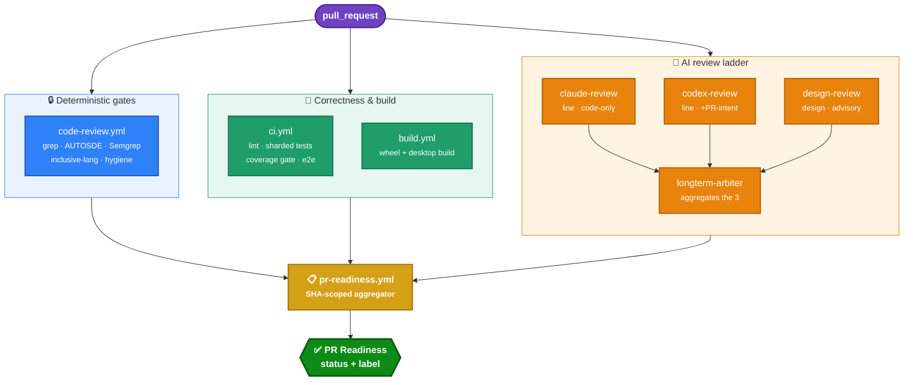
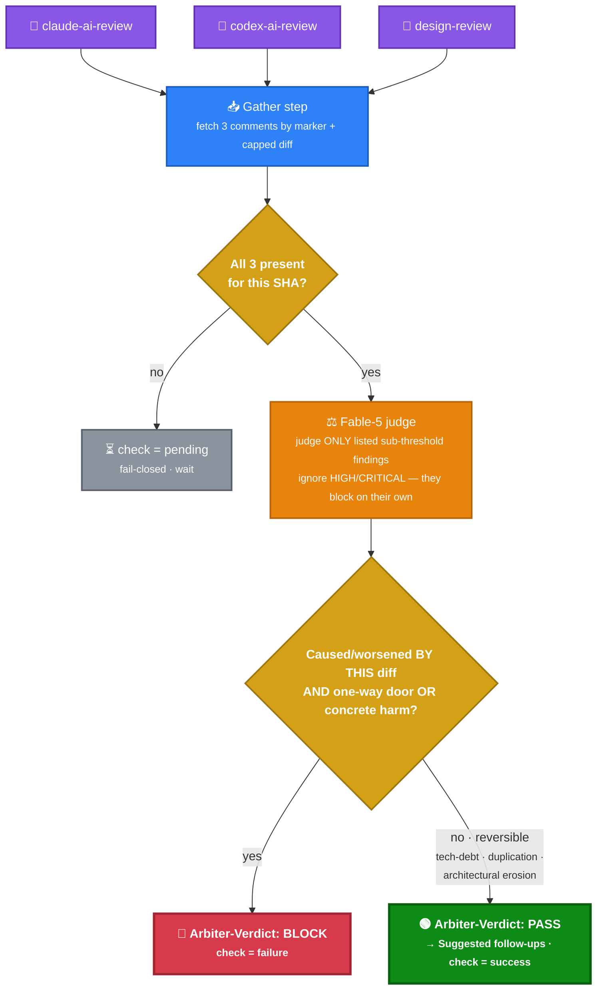
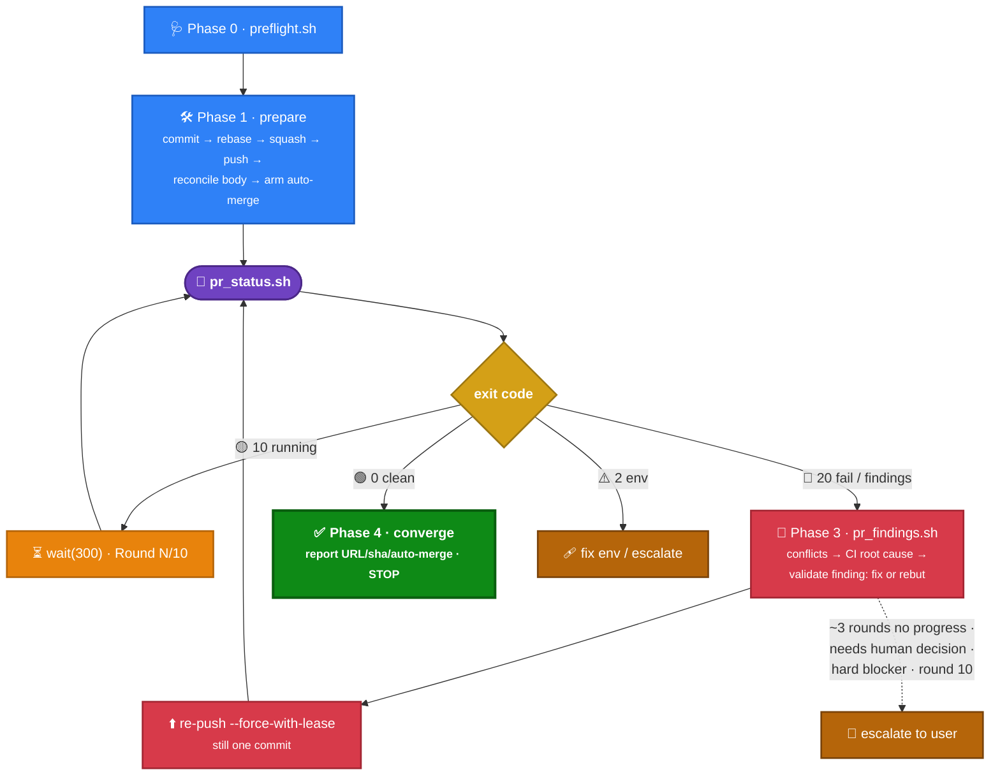

# KiroCrew CI & Prepare-PR — How It Works

_Source of truth: `.github/workflows/*` on `main` (@ `e7e9256c`) and the `prepare-pr` skill._

This doc explains (1) the overall shape of KiroCrew's CI, (2) the purpose and design of each workflow — with emphasis on the four AI reviewers and the Arbiter — and (3) how the `prepare-pr` skill drives a change to review-ready by working *with* CI, including how the whole system resists over-engineering.

---

## 1. Overall structure

CI is a **fan-out of many independent workflows that a single aggregator folds into one verdict.** There are five layers:



Plus two out-of-band layers not on the PR path:
- **Release / publish** (`release`, `build-wheel`, `build-desktop`, `publish-cli`, `publish-linux`, `sign-and-notarize`, `nightly`, `pages`) — triggered by tags/schedules, never gate a PR.
- **Maintenance** (`ship-report`, `cleanup-temp-screenshots`, `test-durations`) — scheduled housekeeping.

Two structural facts that explain everything else:
- **`main` has ZERO required status checks.** Every gate can go red, but nothing GitHub-*blocks* a merge. The real gate is **human approval + armed auto-merge**. Red checks are strong signals a human can override.
- **Fork PRs run no secret-bearing workflow.** The AI reviewers + CodeQL need OIDC/Bedrock creds, so fork PRs fail closed on those and readiness rests on CI + Build + Code Review only.

---

## 2. Purpose & design of each workflow

### 2a. Deterministic pre-gate — `code-review.yml` ("Code Review")

The grep-based half of the AUTOSDE rules — no model, no secrets, so it's safe on forks and always runs.

- **`autosde-rules`** — blocks unambiguous frontend violations (inline `<svg viewBox>` except brand-mark files like `KiroGhost.tsx`/`*Logo.tsx` — the PR #511 exception; `onClick` without `role`; `.innerHTML =`; Mermaid `securityLevel:'loose'`; oversized page wrappers) and backend keystones (sensitive-path reads not routed through `is_sensitive_path()`; `denied_commands.json` floor; bare `bool()` on opt-out fields — `bool("false")` is truthy).
- **`inclusive-language`** — `woke` (SHA-pinned) on added lines, fails only on `(error)` severity.
- **`sast`** — Semgrep `1.78`, diff-only, `p/python p/typescript p/security-audit p/secrets`, `--error` (**blocking**).
- **`dep-audit`** — pip-audit + npm audit, `continue-on-error` (advisory).
- **`pr-hygiene`** — Conventional-Commits title regex + single-commit enforcement (`rev-list --count == 1`), both blocking.

The semantic cases a grep can't express are delegated to the Opus line reviewer.

### 2b. Correctness — `ci.yml` ("CI")

Primary correctness gate. Blocking jobs:
- **`scrub-lint`** — fails on any Amazon-internal marker in the public tree (this is a public repo).
- **`backend-lint`** — `isort`/`flake8`/`mypy` on Python 3.10 + 3.12 (`black --check` currently disabled).
- **`backend-test`** — 3.10×3.12 × 4 shards (8 jobs), pytest-split duration-balanced via `.test_durations`, coverage collected only on 3.12. Plus **`backend-test-windows`** (windows-latest, 4 shards, `--no-cov`).
- **`coverage-combine` → `coverage-gate`** — combines shard coverage, then enforces **backend ≥ 70%, frontend ≥ 60%** on raw line-rate. Runs `if: always()` and fails unless both upstreams succeeded, so a skipped required check can't count as satisfied (fail-closed).
- **`frontend-lint`** — `tsc -b`, `eslint --max-warnings 1116` (a ratchet baseline — do not raise), `jscpd`.
- **`frontend-test`** — `vitest run --coverage`.
- **`e2e`** — offline Playwright run against a stubbed ACP backend (`KIROCREW_E2E_REQUIRE=1`), no model cost.

_CodeQL is not a checked-in workflow — it runs via GitHub default-setup and is referenced only by pr-readiness._

### 2c. Build — `build.yml` ("Build")

PR-time proof the artifacts still build (no publishing): **`build-wheel`** (build → `pip install dist/*.whl` → `kirocrew --version` smoke) and **`build-desktop`** (macOS + Linux Electron build, unsigned).

### 2d. The AI review ladder

Four reviewers, each with a distinct question and a distinct trust posture. The key design axis is **what each is allowed to read** (prompt-injection surface) and **whether it can block**.

| Reviewer | Model / harness | Reads | Question it answers | Can block? | Fail posture |
|---|---|---|---|---|---|
| **Claude AI Review** (`claude-review`) | Opus 5, agentic (`claude-code-action`), 1 pass (2nd only for security/large diffs) | **CODE ONLY** — `Read/Grep/Glob/gh pr diff`; **no `gh pr view`/`gh api`** | Line-level correctness/security/AUTOSDE | Yes | **Fail-closed** |
| **GPT 5.6 Review** (`codex-review`) | GPT 5.6, non-agentic single-shot, real **3-pass** (discover→discover→reconcile) | Code + **PR title/description + prior-round context as nonce-wrapped UNTRUSTED data** | Line-level (2nd perspective) **+ description↔diff consistency** | Yes | **Fail-closed** |
| **Design Review** (`design-review`) | Fable 5, agentic | Code + `gh pr view` (must judge intent) | **Should we build this? Is it the right *shape*?** | No (advisory) | **Fail-open/neutral**, red only on genuine BLOCK |
| **Arbiter** (`longterm-arbiter`) | Fable 5, `Read` only (2 pre-fetched files) | The **other three reviewers' posted comments** + capped diff | Which sub-threshold findings have real long-term impact | Yes (narrow bar) | Fail-closed until all 3 present; neutral on model error |

Cross-cutting design details:

- **Why Claude is code-only:** it's the *write-capable agentic* reviewer, so pulling attacker-controllable PR title/description/comments into its context is a prompt-injection surface. That responsibility (PR-intent + description-vs-diff mismatch) is deliberately handed to the **read-only, non-agentic** Codex reviewer, which treats that prose as **UNTRUSTED evidence, never authority to waive a code finding.**
- **Asymmetric multi-pass is intentional, not inconsistent:** the agentic Claude harness already loops internally (1 careful pass suffices), while the lean single-shot Codex CLI benefits from real separate invocations (3 passes; pass 3 is the authoritative reconciliation and the only gated verdict).
- **Verdicts are structured markers, not free prose:** Claude uses a `--json-schema` `{reviewed, block_merge, summary}` read from `structured_output` (not a scraped comment). Codex emits `[CODEX-REVIEWED] <sha>` always and `[BLOCK-MERGE] <sha>` only when a blocking CRITICAL/HIGH exists, with a coherence backstop (a `Severity: HIGH` line without `[BLOCK-MERGE]` fails closed as self-contradictory). Design emits `Design-Verdict: PASS|CONCERNS|BLOCK`. Arbiter emits `Arbiter-Verdict: BLOCK|PASS`.
- **Security guards:** explicit fork guards (`head.repo.full_name == github.repository`), `persist-credentials:false`, least-privilege Bedrock roles assumed *late* (after npm install so it never sees creds), read-only network-unshared sandboxes, and post-run redaction of AWS key/ARN/account shapes before any public comment.
- **Human override** (`ai-review-human-override.yml`): a repo writer can post `/ai-review override <fable|gpt|arbiter|all> <head-sha>: <reason>`. It runs from the trusted default branch, validates target + 7-40-hex sha + writer permission + **commit freshness** (sha must be current head), then records a bot-authored marker the reviewers trust. Scope is **this commit only** — a new push needs a new judgment.

### 2e. The Arbiter, specifically (the second-order reviewer)

The Arbiter is the piece most people misunderstand, so it's worth spelling out. It is **not** a fifth line reviewer — it is a **second-order aggregator that judges the other reviewers' comments.**

- **Trigger:** `workflow_run: completed` on the three reviewer workflows (it's its own workflow precisely so it can fire *after* Design Review completes — a job can't be triggered by its own workflow's completion). Its "Gather" step deterministically fetches the three reviewer comments by their hidden markers (`<!-- claude-ai-review -->`, `<!-- codex-ai-review -->`, `<!-- design-review -->`) plus the capped diff.
- **Instruction:** *"Do NOT re-review the code from scratch and do NOT invent new findings… HIGH/CRITICAL items are already handled by the reviewers and block on their own — ignore them here."* It looks **only** at the sub-threshold findings the others already surfaced and decides which few must block for long-term reasons.
- **Deliberately narrow blocking bar** — escalate a listed finding to BLOCK only if it is caused/worsened **by this diff** AND meets one of:
  - **One-way door** — an expensive-to-reverse contract / API / schema / persisted-data / wire-format decision merging locks in; or
  - **Concrete harm** — a security regression, data-correctness/loss, or availability regression (must *name the concrete trigger and outcome*).
- **Everything reversible is explicitly NOT a blocker:** *"DO NOT block for: architectural erosion, ownership-boundary drift, maintainability / tech-debt … missing abstraction, duplication, or 'this should eventually be refactored' … The author does NOT need a perfect or complete solution in THIS PR."* A **SCOPE TEST** further requires that a "related influence" both clears the narrow bar *and* is created/worsened by this PR — pre-existing concerns route to `### Suggested follow-ups` (rendered under both BLOCK and PASS), never gate.
- **Gating handle:** an API-posted check-run **"Arbiter — judge from comments"**. `waiting` (not all 3 reviewer comments present for the SHA) stays pending/fail-closed; `ready`+PASS → success; `ready`+BLOCK → failure; unparsable/model-error → neutral.



### 2f. The aggregator — `pr-readiness.yml` ("PR Readiness")

Executes no tests. It resolves the PR's current head SHA, **drops stale events**, collects the latest run per required workflow, and folds them into **one `PR Readiness` commit status + one `readiness:` label** (`passed` / `checking` / `action required`).

- **Always required:** CI, Build, Code Review.
- **Non-fork also required:** CodeQL, Claude, GPT 5.6, Arbiter.
- **Design Review is completion-required but advisory** — its verdict/infra failures score as `"(advisory)"` and never independently block (its job is to feed the Arbiter).
- **Forks skip** CodeQL + all four bots.

---

## 3. Prepare-PR — and how it rides CI

The `prepare-pr` skill drives whatever is in the working tree to **review-ready** (one clean commit, PR open, all required checks green, no open legitimate High/Medium findings). It **never merges** — it only *arms* GitHub auto-merge so the PR lands after a human approves and checks are green.

### 3a. Phase flow

- **Phase 0 — Preflight** (`preflight.sh`): repo/branch/base/auth/dirty/divergence/existing-PR. `0` proceed · `30` blocker (usually: on protected branch → `git switch -c <type>/<slug>`) · `2` env.
- **Phase 1 — Prepare:** commit (specific files, Conventional-Commits subject) → `git rebase origin/<base>` → **squash to one commit** (`git reset --soft origin/<base> && git commit`) → **mandatory pre-submit review** (fan the diff to two independent read-only subagents, fix verified Critical/High locally, one focused verifier) → push (`-u` first, `--force-with-lease` after own squash) → **reconcile the description with the diff (mandatory)** → create/update PR → arm auto-merge.
- **Phase 2 — Poll** (full loop only, max 10 rounds ~5 min): loop on `pr_status.sh`.
- **Phase 3 — Triage & fix** (on exit 20): `pr_findings.sh`, then fix in order — conflicts → CI/build/test root cause → review findings — re-push (still one commit), and **record GPT dispositions before the next push** (§3d).
- **Phase 4 — Converge or escalate:** on `pr_status.sh`=0 report URL/sha/auto-merge state and stop; escalate early if convergence stalls.

> **Which skill version:** the authoritative `prepare-pr` skill lives in-repo at `skills/kirocrew-dev/prepare-pr/` with **Python** scripts (`preflight.py`, `pr_status.py`, …). The pre-submit-review and disposition steps below were added in **PR #528**. An older Bash (`.sh`) copy may still be installed under `~/.kiro/crew/skills/prepare-pr/` — treat the in-repo Python skill as source of truth.

### 3b. How it integrates with CI — the exit-code contract

The skill's design principle is **script-first / deterministic exit codes** — *"decisions come from script exit codes, not eyeballing."* The AI only engages on a red signal; yes/no gates ("round complete? clean? blocked?") are decided by scripts, not model judgment. `pr_status.sh` is the loop driver:

```
0  → FINISHED and CLEAN  (all checks green, no unresolved threads)   → Phase 4 converge
10 → still RUNNING       (a required check queued/in_progress)       → wait(300) & re-poll
20 → FINISHED with FAILURES or unresolved review findings            → Phase 3 drill in & fix
2  → env error           (gh missing / not authed / no PR)           → fix env or escalate
```

`pr_status.sh` makes one `gh pr view … --json statusCheckRollup,reviewDecision,…` call and normalizes the mixed CheckRun/StatusContext rollup via `jq` into `running` / `failing` counts, plus a GraphQL `reviewThreads` query counting `isResolved==false`. Its ordered logic — *any running → 10; else any failing → 20; else any unresolved thread → 20; else 0* — is exactly what maps CI's fan-out (§1) back to a single agent action. This is the client-side mirror of what `pr-readiness.yml` does server-side.



A **round is only complete when every required check has finished AND every bot has posted** — acting on a half-finished round means fixing a moving target. On exit 20, `pr_findings.sh` pulls failing-log tails (`gh run view <run-id> --log-failed`) and unresolved threads as `path:line [author] body`.

**Auto-merge** (`enable_automerge.sh`, default `--squash`, matching the single-commit invariant) is idempotent and does *not* merge now — GitHub completes the merge only after required checks are green **and** `reviewDecision=APPROVED`, so the human gate is preserved. Exit `20` (auto-merge disabled / no branch-protection rule / no permission) is a non-blocking note.

**Round cap = 10** (unconditional backstop), but **escalate early** the moment convergence stalls: ~3 rounds with no drop in failing-check / open-High-Medium count, a finding needing a human/product/design decision, or a hard external blocker (infra/permissions, a check that never runs).

### 3c. The PR description contract

Reconciled against the diff before **every** publish (Phase 1.5), driven by `diff_signals.sh` (flags deps/lockfiles/migrations/CI/deletions/config as `⚠`). Five sections — body must be **complete** (covers every `⚠`) and **accurate** (no claim the diff doesn't support):

1. **Problem** — the concrete symptom.
2. **Why it matters** — impact if unfixed.
3. **Fix (symptom → root cause → change)** — chain of thought, so the reader sees *why this is the right fix*.
4. **Tests** — what each added/updated test locks in.
5. **Manual verification** — steps where unit tests fall short, or "N/A — unit coverage sufficient" with a one-liner.

This contract is not busywork: it's the exact input the **Codex reviewer** and **Design Review** read to judge description↔diff fidelity and scope. A body that overclaims triggers a real finding.

### 3d. Cross-round convergence — how repeat findings are avoided (PR #528)

The most expensive failure mode is not a *wrong* review — it's a review that keeps **re-litigating settled points** round after round. #528 attacks this with three interlocking mechanisms. Model the cost of the review loop as `rounds × (CI latency + model latency + human attention)`; each mechanism cuts a different term.

**1. Pre-submit dual-subagent review (shift-left) — cuts the round *count*.** Before the *first* push, `prepare-pr` fans the finished diff out to **two independent read-only subagents** that review under the *same* severity/blocking contract as the GitHub reviewers; verified Critical/High are fixed locally, then **one focused verifier** confirms. A GitHub round costs CI spin-up + model latency + a re-push (~5+ min); every blocker caught locally is a round never paid for. Two independent passes raise recall at zero cloud cost, so round 1 on GitHub starts from an already-cleaned diff — collapsing `push → wait → findings → fix → push → wait` into `local-review → fix → push → (likely green)`. Medium/Low advice is deliberately *not* acted on here, so pre-review can't become scope growth.

**2. Disposition recording — gives the cloud reviewer memory.** When a round fixes or rebuts a GPT finding, `prepare-pr` posts one concise comment beginning `<!-- ai-review-disposition target=gpt -->` **before** the next push. It names the prior reviewed SHA and marks each finding `fixed` / `rebutted` / `accepted` with the smallest evidence-based reason. This is **untrusted continuity evidence** — it does *not* authorize or suppress a finding, and the formal `/ai-review override` stays current-SHA-scoped.

**3. Codex pass-3 convergence — consumes that memory monotonically.** GPT 5.6 runs exactly three calls: passes 1–2 discover candidates; **pass 3** rechecks the full diff, ingests a *bounded* prior-review bundle (previous GPT review + bot-recorded overrides + writer dispositions, nonce-delimited, treated as untrusted), reconciles it, and alone publishes/gates the verdict. The rule that makes it converge: **a concrete code/evidence delta is required to re-raise or reverse settled guidance — "a new commit SHA by itself is not a delta."** So a point you already rebutted stays quiet unless the *code* changed in a way that genuinely reopens it.

**Producer / consumer interlock.** `prepare-pr` is the **producer** (writes durable dispositions, never silently appeases, and bails out via escalate-on-stall) and the **circuit-breaker**; Codex pass-3 is the **consumer** (reconciles the record against changed code instead of re-arguing from scratch). Neither works alone: without the disposition record Codex has nothing to converge against; without Codex's delta rule the record wouldn't suppress repeats.

**Why it's better *and* cheaper.** Better = more eyes (two local subagents + the GitHub reviewers) and self-consistent guidance that can't contradict itself across rounds. Cheaper = fewer rounds to begin with (shift-left), each round makes forward progress (memory), and progress is monotonic (no backsliding). The older design optimized *per-round* review quality; #528 optimizes the *number and progress* of rounds — which is where the wall-clock actually went. The single **`PR Readiness`** status (§2f) closes it off with one trustworthy "is this SHA done?" answer, so nobody eyeballs 35 checks to decide when to stop.

---

## 4. Special topic: how the system avoids over-engineering

AI-native coding skews toward over-engineering — extra layers, abstractions, config knobs, defensive scaffolding — and naïve AI reviewers *compound* it by demanding still more mechanisms, creating infinite review loops. KiroCrew counters this at every layer:

- **Line reviewers (Claude + Codex) share an identical PROPORTIONALITY block:** *"a suggested Fix MUST be the smallest change… The mere ABSENCE of an extra mechanism is NOT a finding; a request to 'add mechanism X' for a hypothetical is LOW/advisory at most."* Plus a scope cap — **Claude** stays within "the evident scope of *this diff*", **Codex** within "the PR's stated purpose" (it reads the description, Claude doesn't). PREMISE/DESIGN concerns are **advisory (MEDIUM), never BLOCK unless a one-way door.**
- **A strict BLOCKING BAR:** a finding blocks *only* if CRITICAL/HIGH **and** one of {reachable security hole with a concrete trigger, broken security keystone, crash/data-loss on a changed path, a `blocking:true` AUTOSDE violation, a missing regression test}. Style / naming / speculative-perf / hypotheticals never block.
- **Design Review's Suggestions must be proportionate:** *"NEVER recommend extra layers, abstractions, or future-proofing the problem does not require (over-engineered suggestions become new surface a later review flags)."* It also carries the **Design-Simpler-Alternative** ethos — actively flag when a materially simpler solution exists — but always **advisory**, never raising the verdict to BLOCK. Its tie-breaker: *"when torn between BLOCK and CONCERNS, choose CONCERNS… Only reach for BLOCK when the DESIGN is wrong — never merely because the change is large."*
- **The Arbiter enforces it by omission:** everything reversible (architectural erosion, maintainability, "should eventually be refactored") is routed to non-blocking follow-ups; only one-way doors and concrete harm caused by *this* diff can block. *"The author does NOT need a perfect or complete solution in THIS PR."*
- **prepare-pr's severity gate closes the loop:** it validates each finding's legitimacy first — fix true High/Medium, **rebut false positives with evidence rather than appeasing them by changing correct code**, defer Low/nits. Combined with single-commit + description reconciliation, this keeps a PR converging on its stated purpose instead of accreting scope round over round.

Net: expensive/irreversible risk blocks; everything else is advice a human can take or defer — the design deliberately refuses to let "more mechanism" be a blocking demand.
