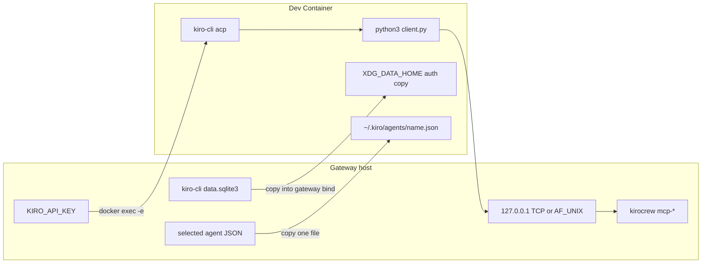

# Near-production opt-in Dev Containers

The preview stays gated (`KIROCREW_DEVCONTAINERS=1` + `agent.devcontainer: auto`).
This is the product contract for an **enabled, trusted** session on Linux and
macOS (Windows follows the same Docker Desktop path). It does not flip defaults.

Shipped behavior is the [module spec](../system-specs/modules/devcontainers.md)
and the [user guide](../devcontainers.md). This document is the agreed plan:
what an enabled session must do, the security floor that stays closed, and what
is still out of scope for a prod default.

## Security floor

These stay refused:

- no wholesale `~/.kiro/agents`
- no `KIROCREW_HOME`
- no `--network=host` / `privileged` / `docker.sock`
- dashboard stays on `127.0.0.1`
- closed screen stays five classes
- `features` stay refused
- fail to host, never fail the spawn

## 1. Run on Docker Desktop (macOS / Windows)

`unsupported_platform` is only for a host with no usable Docker, not merely
`sys.platform != "linux"`. Darwin/Windows with Docker Desktop are eligible;
no-docker still fails to host with `docker_unavailable`. On macOS the
Desktop CLI lives in a user-owned `.app` bundle; it is accepted only when
Apple Developer ID `Docker Inc` (`9BNSXJN65R`) still verifies.

## 2. MCP bridge: unix on native Linux, TCP on Desktop

Bind-mounted `AF_UNIX` sockets do not survive Docker Desktop's VM file share.
Unix stays on native Linux; Darwin/Windows use TCP.

- Host listener: `asyncio.start_server(..., host="127.0.0.1", port=0)` only —
  never `0.0.0.0`.
- Container client (`devcontainer_mcp_client.py`): `AF_INET` to
  `host.docker.internal:<port>` (stdlib-only, no `kiro_crew`).
- ACP entries: `python3 client.py tcp host.docker.internal <port> <secret>` vs a
  unix socket path plus the same secret. The host accept loop refuses a
  connect that does not offer it, so reaching `host.docker.internal` from a
  sibling container is not enough to invoke MCP.
- The bind mount stays — it delivers `client.py`. Sockets are Linux-only.
- After the sensitive-path screen, inject
  `--add-host=host.docker.internal:host-gateway` on native Linux so the same
  TCP client can reach host loopback. This is not `--network=host` and does
  not grow the closed screen.
- `python3` in the image remains required (stdio shim). No helper binary is
  downloaded.

## 3. Auth: API key + login store

**`KIRO_API_KEY`.** Host spawn injects the key on the process env after
`containerize_spawn` builds `devc_env`, so the same inject runs on `devc_env`
itself before `exec_argv`.

**Login store.** Reuse `kiro_cli_state_dbs()`. At `up()` / spawn, **copy** the
host `data.sqlite3` (do not live-bind `~/Library/Application Support` — Desktop
+ SQLite locking) into a gateway-owned dir under
`/tmp/kirocrew-auth/<token>/kiro-cli/`. Inject that bind after the screen onto
`/tmp/kirocrew-auth`. Forward `XDG_DATA_HOME=/tmp/kirocrew-auth` on `docker exec`
so in-container kiro-cli reads the Linux-shaped path. Dir `0755`, db `0644`
(`remoteUser` ≠ gateway uid). Refresh the copy when the host file is newer.
One-way: a login inside the container does not write back to the host.

Never mount `~/.aws`, `~/.ssh`, `KIROCREW_HOME`, or the rest of `~/.kiro`.

## 4. One selected agent file

Project `.kiro/agents/<name>.json` is the first lookup (workspace bind).

If it is missing, copy **only** `~/.kiro/agents/<name>.json` (via
`kiro_agents_dir()`) into `/tmp/kirocrew-kiro-home/<token>/agents/<name>.json`.
Bind that directory onto `<remoteUserHome>/.kiro/agents` (home from `remoteUser`
in the parsed config: `/root` vs `/home/<user>`). Populate at spawn so one
container can serve different agents over time.

`ensure_agent_definition_available` copies if needed, then re-probes; it fails
only if the host also has no file. The whole agents directory is never mounted.

## 5. Pooling guard

`cwd_blocks_pool` already keeps other projects off the warm pool. A session
whose work dir has a trusted config must not claim a pool runtime whose
execution locus is host (or whose `work_dir` was decided before trust). Default
`session.pool_size` is `0`; this closes the default-workspace edge
(`bypass_devcontainer`).

## 6. Docs and UX

Trust card, “start a new session”, and the execution chip stay. Chip copy is
unchanged, so no i18n catalog work. `unsupported_platform` remains only for
hosts with no usable Docker.

## Out of scope (still not a prod default)

- Turning the feature on without the two locks.
- Allowing `features` (registry merge still makes the grant a lie).
- Gateway installing `kiro-cli` into the image (existing invariant in
  `kiro_prerequisite.py`).
- Privileged cgroups / per-exec PID namespace (orphan kill limitation stays).
- Live Docker in CI (no `KIROCREW_DEVCONTAINERS` there).
