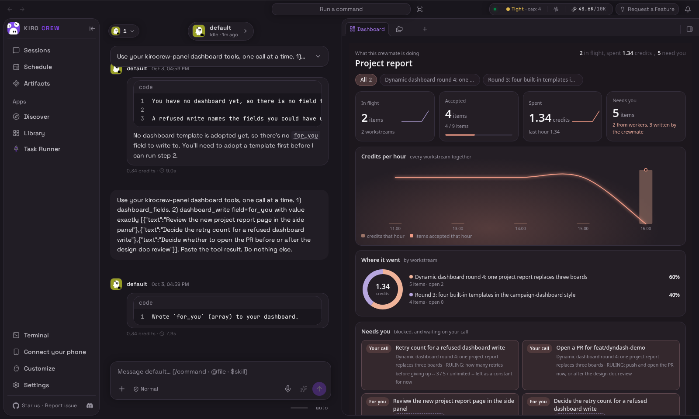
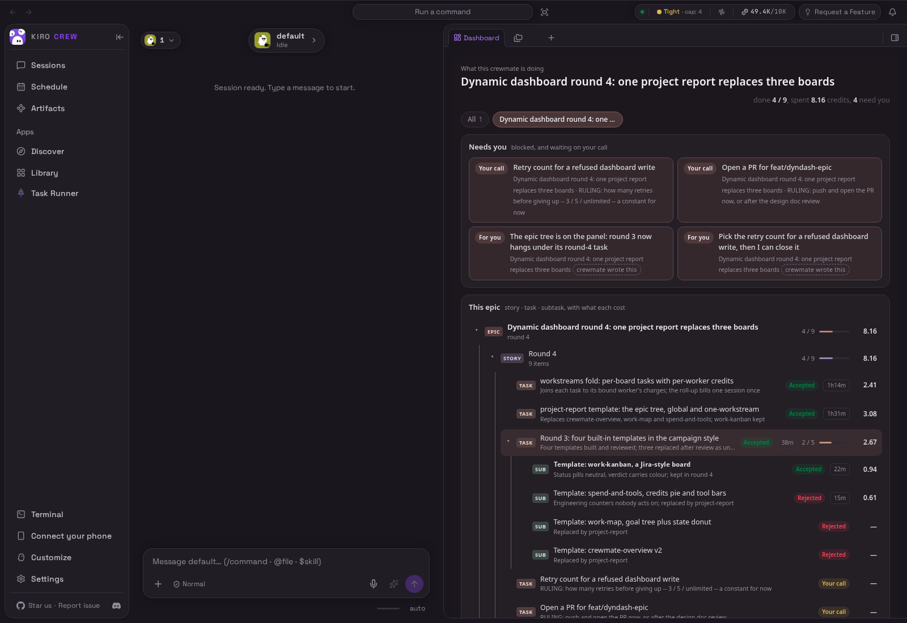
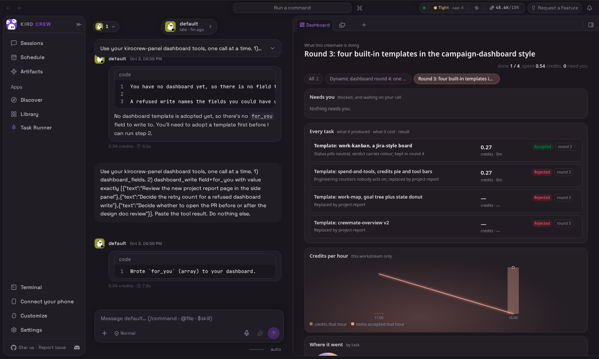

# RFC: Crewmate dynamic dashboard -- a project report beside every crewmate's chat

- Status: in-progress. This document ships INSIDE its implementing pull
  request: the repository takes no standalone RFC pull requests, so `doc-pr` is
  null and the implementation is the one named in `implementation-prs`. The
  First Principles lane reads an RFC's status off the **base** branch, so until
  this document is on main it reads as absent to that lane; clearing the lane is
  a maintainer's call (an override on the final head, or merging this document
  first), not this pull request's.
- Author: written up by the crew that implements it.
- Created: 2026-10-03
- Related:
  [`../system-specs/modules/dashboard-instances.md`](../system-specs/modules/dashboard-instances.md)
  (the shipped contract for templates, instances, versions and snapshots),
  [`../reference/crew-log/fold-paths.md`](../reference/crew-log/fold-paths.md)
  (every value a session fold renders),
  [rfc-append-only-ledger.md](rfc-append-only-ledger.md) (the crew log the page
  reads), [rfc-conductor-work-ledger.md](rfc-conductor-work-ledger.md) (the
  boards and work items the report rolls up),
  [rfc-composable-layout-mechanism.md](rfc-composable-layout-mechanism.md) (the
  sibling design for assigning a view to a surface).

## Summary

A crewmate's work lives in its chat. To learn what it did, what it spent and
what it needs from you, you scroll the transcript. This design puts that answer
on one page in the side panel, next to the chat:

- **what the crewmate is doing**: every workstream it runs, and every task
  inside each one
- **what it cost**: credits per task, per workstream, per hour
- **what came out**: accepted, rejected, still in flight
- **what it needs from you**: blocked tasks, open questions, and the lines the
  crewmate itself wants you to act on

The page is a template the crewmate adopts, filled from the crew log. The
crewmate can also write its own values into it, and those are marked as its own.

## Motivation

Three things a reader wants about a crewmate are each recoverable today, and
each costs a scroll:

1. **What is in flight.** The work ledger holds it, and the only rendering of it
   is a transcript the conductor and its workers wrote to each other.
2. **What it cost.** The usage fold holds per-session spend. Attributing spend to
   a *task* means knowing which worker session that task bound, which no surface
   joins.
3. **What needs a human.** A worker's `blocked` or `question` report is one line
   in a log that keeps growing past it.

The transcript is the record and should stay the record. What is missing is a
view over it that is current without a model call.

## Goals

- One page per crewmate, in the side panel beside its chat, answering the four
  questions above.
- Every number on it comes from a fold, so opening the page costs no model call
  and no full-log scan.
- A crewmate may fill a value no fold records, and the page must mark such a
  value as the crewmate's own rather than as a recorded fact.
- The page is data, not code: a template is loadable at run time and shareable
  between installs.

## Non-goals

- Live refresh. P1 paints on open; the WebSocket path is P2.
- A template editor. P1 ships built-ins and an import path, not an authoring UI.
- Replacing the transcript. The page is a view over the same log.
- Cross-crewmate rollup. One page is one crewmate.

## Design

### One page for everything the crewmate runs

The default view is **All**. A row of pills at the top holds `All` plus one pill
per epic, so switching between the different things the crewmate is doing is one
click.

| Block | What it answers |
|---|---|
| Headline | How many tasks are in flight, total spend, how many need you |
| Four cards | In flight, accepted (with progress bar), spent (with trend line), needs you |
| Credits per hour | Spend over time across every workstream, with tasks accepted each hour |
| Where it went | A donut of spend by workstream |
| Needs you | One card per item: tasks asking a question or blocked, plus the crewmate's own notes |
| Every epic | One tree of the work, with done/total, a progress bar and a cost on every row |

### The work as a tree

`project-report` drew the board list flat and put their tasks on a stage board,
so the work's own shape was nowhere on the page. It draws one tree of four
levels instead -- a board's goal is an EPIC, a round of it a STORY, a work item
a TASK, an item on a board that task's own worker runs a SUB -- beside a
two-ring sunburst of the same money.

Each row carries a level tag in its own tint, every tint a theme variable, so
both themes render the levels the product's own way rather than a hard-coded
hex. Leaves keep the result pills (Accepted / Rejected / Your call / Awaiting my
verdict), their pull-request chip and their duration. Epics and the newest story
of each start open; tasks start shut, so an epic opens onto its rounds rather
than onto every item at once.

The rings are always the two levels UNDER the tree's root: epic inside and story
outside in the global view, story inside and task outside scoped to one epic.
That is what keeps "inside" and "outside" meaning one thing in both views -- a
share of the root, and a share of that share -- instead of a drill-down into a
different vocabulary.

### One workstream, task by task

Clicking a workstream pill narrows the same page to that one goal. Needs-you
comes first. Below it, every task gets one row: what it produced, what it cost,
how long it ran, and its result.

A task whose worker reported no cost shows a dash, never `0`. A zero would claim
the work was free.

### Where the numbers come from

Every number comes from a **fold**: a small, always-current view the gateway
keeps over the crew log, projected in
[`../../src/kiro_crew/crew_log/projection.py`](../../src/kiro_crew/crew_log/projection.py).
The page never scans the whole log.

| Source | Who writes it | Used for |
|---|---|---|
| `workstreams` fold (new) | The gateway | Every board, its tasks, and each task's credits, joined from the bound worker's usage |
| Crew-log folds (`usage`, `timeline`, `work`, `ledger`, ...) | The gateway | Spend, activity, task state |
| Agentic fold | The crewmate, through `dashboard_write` | Values no fold has yet, such as "what I want you to look at next" |
| `mistakes` fold (new) | The gateway | Every refused write, so the crewmate sees its past errors before it writes again |

The `workstreams` fold carries two keys a reader cannot derive. A nested board
carries `parent: {board, item_id, title}`, read at RENDER rather than recorded
when the bind is folded: a bind can reach the fold after the sub-board's own
entries, and a link written at step time would then be missing for exactly the
boards that have one. A board whose own task bound its own slot is not its own
subtask, and a worker bound to two tasks names one parent -- the first, in board
then item order -- so the tree has one shape on every read.

Each task row also carries the `worker_session_key` it was costed through, and
reports that worker's whole spend, which is the fold's own posture: that is what
the task cost to run. One session bound to two tasks therefore appears twice at
the same amount, so a tree that ADDED its rows up would bill that session once
per task it served. A node therefore does not carry a number; it carries the SET
of sessions its subtree was billed through, and the number is that set's values
summed. A subtree nobody measured draws a dash.

### Agentic values

The crewmate is encouraged to read folds first, but it may fill values in
itself through
[`../../src/kiro_crew/dashboard_agentic.py`](../../src/kiro_crew/dashboard_agentic.py).
What it writes is type-checked against the template's contract. A wrong write is
refused, recorded in `mistakes`, and the crewmate retries. On the page its values
carry a dashed **crewmate wrote this** tag, so the reader can tell a recorded
fact from the crewmate's own judgment. In the screenshots above, three of the
five needs-you cards were written by the crewmate itself during a real turn.

### Templates are copied, versioned and shared

A template is one `manifest.json` (fields, types, which fold each comes from)
plus one `template.html` (layout and JS). It holds no server code, so the
gateway can load it at run time.

| Part | What it does | Where |
|---|---|---|
| Registry | Built-in templates ship in the repo; user templates are stored per user | [`../../src/kiro_crew/dashboard_templates/catalog.py`](../../src/kiro_crew/dashboard_templates/catalog.py) |
| Manifest | Declares each field, its type and its fold path | [`../../src/kiro_crew/dashboard_templates/manifest.py`](../../src/kiro_crew/dashboard_templates/manifest.py) |
| Adopt and versions | The crewmate copies a template into its own instance; each edit is a new version, and rollback is a new version too | [`../../src/kiro_crew/dashboard_templates/instance.py`](../../src/kiro_crew/dashboard_templates/instance.py) |
| Share | Export to one file; import adds it to the registry | [`../../src/kiro_crew/dashboard_templates/share.py`](../../src/kiro_crew/dashboard_templates/share.py) |
| Snapshot | Freezes the template, its version and the fold values at that moment | [`../../src/kiro_crew/dashboard_templates/snapshot.py`](../../src/kiro_crew/dashboard_templates/snapshot.py) |

Built-ins today: `project-report` (the default, shown above), `work-kanban`,
`goal-board` and `session-ledger`, documented in
[`../../src/kiro_crew/dashboard_templates/builtin/README.md`](../../src/kiro_crew/dashboard_templates/builtin/README.md).
`work-kanban` is a stage-column board with one row per work item.

### Relationship to the dev-time template package already on main

`src/kiro_crew/dashboard_templates/` exists before this change as a **dev-time**
contract model: a template is four files plus a registration line in
[`../../src/kiro_crew/dashboard_templates/registry.py`](../../src/kiro_crew/dashboard_templates/registry.py),
its data half is built by typed Python whose return type mypy checks, and its
`REGISTRY` is deliberately empty because the machinery shipped before the first
template. This design adds a second source to the same package rather than
replacing that one: a template described entirely by `manifest.json` plus
`template.html`, loadable without a release.

What the two share is the invariant that made the first one worth having. Both
go through
[`../../src/kiro_crew/dashboard_templates/parity.py`](../../src/kiro_crew/dashboard_templates/parity.py):
the set of `data-dashboard-field` names in the HTML must equal the set of fields
the contract declares, in both directions. For a manifest-described template
`check_parity` runs at load, so a malformed template is refused rather than
rendered with empty cells.

What differs is who may author one and when it is checked, and that is the part
this document asks maintainers to accept. The security posture does not move:
the gateway still runs no agent-authored code and evaluates no agent-authored
expression. A crewmate supplies typed VALUES through `dashboard_write`, checked
against the manifest's declared types, and a template's HTML is inert layout the
frame renders with the network blocked.

### How the page is drawn

The page runs in a sandboxed iframe with scripts allowed and the network
blocked, minted by
[`../../src/kiro_crew/dashboard_frame.py`](../../src/kiro_crew/dashboard_frame.py)
and mounted by
[`../../website/src/pages/members/CrewDynamicDashboard.tsx`](../../website/src/pages/members/CrewDynamicDashboard.tsx).
The host injects the fold values as `window.kirocrew` and fills each
`data-dashboard-field` slot. If a field stops resolving, the page keeps its last
good value and shows a stale banner.

## Migration plan

| Phase | Scope | Exit criteria |
|---|---|---|
| P1 (this pull request) | Template format, registry, `workstreams` and `mistakes` folds, agentic writes, project report as the default | The side panel shows real workstreams and real spend, with no model call to update a number |
| P2 | Live refresh over WebSocket; template picker UI | A worker's report moves the page without reopening the tab |
| P3 | Snapshots to shared storage; whole-page and region screenshots | A shared link opens a frozen report |
| P4 | Select a block and have the crewmate rewrite only that block | Such an edit keeps the contract check green |
| P5 | The page changes shape with the work: plan, execute, review | One session shows three layouts across its life |

Each phase is independently shippable and independently abandonable. P4 and P5
are blocked on open question 1 below, because both multiply the number of
refused writes a crewmate has to recover from.

## Backward compatibility

The crewmate Dashboard tab rendered the crewmate's own `panel_publish` document,
and under P1 it renders `project-report`. The page read resolves the default
template for a crewmate that has adopted nothing, so the body always carries a
page and the tab always draws the dynamic dashboard. Nothing in the frontend
renders the published document any more: `panel_publish` still accepts and
stores, `GET /api/members/{slug}/panel` still serves, and
`CrewDashboardFrame` keeps no production caller. That is the decision this
document asks maintainers to record, and it is the one part of P1 that removes a
user-facing surface rather than adding one.

The alternative shape is to leave the default unadopted, so the tab keeps
falling back to the published page and the dynamic dashboard appears only for a
crewmate that adopted a template. It needs one thing P1 does not have: a
reachable way to adopt. `read_instance` requires a `live` instance, so a
crewmate with none has every `dashboard_write` refused, and no surface in P1
calls the adopt route -- which is why P1 resolves the default instead. A phase
that ships an adopt caller can take that shape, and §Open questions 3 records
the choice as open.

No wire contract is rejected, renamed or removed. The three new crew-log entry
types are additive: an older reader that does not declare them stops folding,
which is why they are declared in the same change that writes them.

## Security considerations

- A template is data, and data from an untrusted author is still data: the
  template holds no server code, and the gateway never executes it outside the
  frame.
- The frame's own policy is `default-src 'none'` with scripts allowed and the
  network blocked, so a template cannot reach a host, an endpoint, or another
  crewmate's values.
- An agentic write is type-checked against the manifest's declared contract
  before it is stored, and a refused write is recorded rather than dropped.
- Fold values are read per crewmate slot. A page cannot name another slot's
  fold, because the handler resolves the slot from the request's own identity.

## Alternatives considered

- **A fixed page in the frontend.** Cheapest to build and impossible to share or
  version. It also forces every new number through a frontend release, which is
  the cost this design exists to remove.
- **Let the crewmate write the whole page each turn.** Then every number costs a
  model call and can be wrong. Folds exist precisely so a number is current
  without being re-derived.
- **Record a nested board's parent link when the bind is folded.** Rejected: a
  bind can reach the fold after the sub-board's entries, so the link would be
  missing for exactly the boards that have one.
- **Sum each task row's cost up the tree.** Rejected: it bills one worker session
  once per task it served. The union is what makes a roll-up equal the board
  total.

## Open questions

1. How many retries a refused agentic write gets before the crewmate asks the
   human (3, 5, or unlimited). It is a constant for now.
2. Whether a task's cost should include the conductor's own turns, or only what
   its bound worker spent. This change counts worker spend only.
3. Whether the published `panel_publish` page keeps the Dashboard tab when a
   crewmate has adopted nothing, or the default template takes the tab outright.
   P1 resolves the default, which takes the published page's one rendering
   surface; the alternative needs a reachable adopt, which P1 does not ship.
   Phase 2's template picker is where that caller would land.

## Verification

The template's own rules are pinned by
[`../../test/test_dashboard_template_project-report.py`](../../test/test_dashboard_template_project-report.py),
the fold by
[`../../test/test_workstreams_fold.py`](../../test/test_workstreams_fold.py),
and the registry's built-ins by
[`../../test/test_dashboard_templates_builtin.py`](../../test/test_dashboard_templates_builtin.py).
Six of the template cases are negative-controlled: each rule was broken in turn
and the matching case required to fail -- a roll-up that adds instead of
unioning, a header that re-reads the board row, a cost total starting at `0`, a
nesting index that ignores `parent`, an `All` pill that counts boards, and a
headline card that counts boards.

The committed sample fixtures are checked as evidence in their own right,
because the renders above are taken from them: exactly one board nested under a
retained task, at least one session billed through two costed rows, and at least
one task with no cost at all. Without the shared-worker row a union and a sum
render the same number, so the case asserts the two totals actually differ and
that the fold's own board total equals the union.
[`../../scripts/render_dashboard_builtin.py`](../../scripts/render_dashboard_builtin.py)
renders any built-in from a fixture at both widths and both themes.
