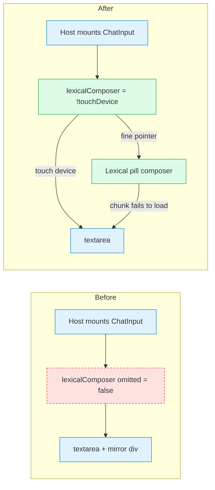

# RFC: Inline paste pills — the Lexical composer becomes the default chat editor on fine-pointer devices

A long paste into the chat composer collapses to a marker such as
`[ Paste #1 · 18 lines ]`. On the shipped `<textarea>` the marker is opaque —
it cannot be read, trimmed or moved before Send — and its highlight is painted by
a mirrored `
` that drifts away from the text as the composer wraps
([#8309](https://github.com/kirodotdev/KiroCrew/issues/8309)).
[#8310](https://github.com/kirodotdev/KiroCrew/pull/8310) landed a Lexical
composer that makes the marker a real inline node, but behind a prop no host
passes, so no user has it. This RFC records the **product-shape decision** that
[#11100](https://github.com/kirodotdev/KiroCrew/pull/11100) implements: the
inline paste-pill composer becomes the default editor of ChatPage, ChatPane and
SideChat on fine-pointer devices, and the `<textarea>` stays where evidence is
missing (touch devices) or the editor cannot load. It is a design of record for
what ships in #11100; nothing of the default is on main.

## Summary

Pass `lexicalComposer={!touchDevice}` from the three chat hosts, so every
non-touch user gets a composer whose collapsed paste is a **pill** they can read,
edit in place, reorder by drag and remove with one keystroke, while the value the
host sees stays the `[ Paste #N · M lines ]` marker string plus the `PasteBlock`
sidecar it already speaks. The positions this RFC takes, one line each:

1. **The default flips for fine-pointer devices only.** Touch devices keep the
   `<textarea>` until a device pass is recorded (Phase 2), and the `<textarea>`
   remains the automatic fallback whenever the Lexical chunk fails to load.
2. **The value contract does not move.** Markers in the text, blocks in the
   sidecar, expansion at send time — drafts, history and the backend are
   untouched. The pill is a view over that contract, not a new one.
3. **Two invariants the `<textarea>` never enforced become load-bearing:** no two
   markers share a seq and no two block records share an id. A marker resolves
   to its block by seq alone and the `<textarea>` removes pills by id, so a
   duplicate silently sent the wrong content or deleted two pills. The host's
   value and blocks are canonicalised in `ChatInput` before either composer is
   chosen, so the `<textarea>` path is held to the same rule.
4. **An edit is never held only by the preview panel.** Every keystroke in the
   pill's preview writes through to the node, the host's block list and the
   persisted draft; Save is one undo step, Cancel restores the opened content.
5. **Rollback is one prop per host, and it stays visible.** A source ratchet
   requires every product `<ChatInput>` mount to name `lexicalComposer` and to
   gate it on the touch signal, so falling back is a deliberate edit, never
   drift.
6. **This amends one line of the ratified composer shape.**
   [rfc-chat-core-extraction](rfc-chat-core-extraction.md) §4 names
   `Composer.Editor` as "(textarea)"; after this RFC the editor atom is Lexical on
   fine-pointer devices and `<textarea>` on touch and on load failure, and the
   not-started `Composer.Paste` atom (P3-c) mounts the node and plugins described
   here rather than re-deriving them.

## Motivation

### Current state

Verified at `0140fdd57`.

- `website/src/components/ChatInput.tsx` declares the optional `lexicalComposer`
  prop and defaults it to `false`; the prop's own comment says it "Defaults off
  so the established textarea path remains the production fallback until parity
  is complete". Outside tests the identifier has no hit anywhere but
  `ChatInput.tsx` itself, so every host renders the `<textarea>`.
- The composer #8310 shipped renders a collapsed paste as
  `website/src/components/PasteTokenNode.tsx`: a read-only pill with a hover
  tooltip, no editing and no reordering. `website/src/composer/` does not exist.
- The `<textarea>` path paints the marker highlight with a mirrored `
`
  behind the input, which is the mechanism behind #8309.
- [rfc-chat-core-extraction](rfc-chat-core-extraction.md) (`partial`) ratified the
  target composer shape on 2026-09-09 as a `Composer` root plus atoms; its
  progress row for P3-c, the `Composer.Paste` atom, reads `not started`.
- Touch detection already exists: `isTouchDevice()` in
  `website/src/utils/isTouchDevice.ts` and `useIsTouchDevice()` in
  `website/src/hooks/useIsTouchDevice.ts`.

### Problems

- Pasting logs, stack traces and code is the dominant way context enters a
  prompt. A paste that cannot be verified or corrected before Send is a prompt
  that goes out slightly wrong, and "delete and paste again" is the only way to
  move it.
- #8310's fix for the detached highlight is unreachable: the code is on main,
  the users hit by #8309 still see the `<textarea>`.
- The `<textarea>` cannot host an atomic, draggable inline element. Overlays,
  mirrors and range hacks are the design that produced #8309; they cannot be
  extended into editing or reordering.
- Keeping two composers alive with one of them unreachable doubles the
  maintenance surface without paying anyone back. The prop must either become
  the default or be deleted; this RFC chooses the former and keeps the prop as
  the fallback and the rollback lever.

## Goals

- A collapsed paste the user can read, edit, reorder and remove in place, on the
  hottest input path in the product, with no change to what the host receives.
- The `<textarea>` remains available wherever the evidence for the Lexical path
  is missing, and degrades in automatically when the editor cannot load.
- A rollback that is one visible line per host, not a release revert of a
  subsystem.

## Non-goals

- No change to the value format, the send payload, draft persistence, history,
  or any backend contract.
- No change to `kiro-cli chat` (the TUI) or to any app-SDK chat embed.
- No user-facing setting for choosing the composer (see *Alternatives* (c)).
- Touch-device behaviour beyond preserving the `<textarea>` there (Phase 2).
- Wiring the paste-block sidecar into ChatPane and SideChat
  ([#11337](https://github.com/kirodotdev/KiroCrew/issues/11337)) and keyboard
  reorder ([#11122](https://github.com/kirodotdev/KiroCrew/issues/11122)) — both
  tracked as later phases.
- Moving the modules under `chat-core/composer/`; that is P3-c's move, owned by
  [rfc-chat-core-extraction](rfc-chat-core-extraction.md).

## Design

### The pill

`PasteBlockNode` (a Lexical `DecoratorNode`) carries the block itself — id, seq,
line count, content — so undo, copy-expansion and the preview never depend on the
host's block list. It is inline, atomic and not keyboard-selectable: arrows step
over it, typing beside it never replaces it, Backspace or Delete removes it in one
keystroke. Its label is the paste's first line (CSS-truncated) and the line count;
the accessible name leads with that snippet, the hover title carries the whole
first line plus the two hidden actions ("Click to edit · drag to reorder"), and a
decorative pencil glyph sits beside the ✕ so editability is visible without
hovering.

### Editing in place

Click or Enter opens an editable preview anchored to the pill (above, or below
when there is no room), sized to content, clamped to the viewport and resizable.
The preview is bound to the pill's Lexical **node key**, never to its seq or id,
and a mutation listener closes it when that node leaves the tree. Every
keystroke writes through to the node under Lexical's `historic` tag (interim
states are not undo entries) and `skip-dom-selection` (the editor never touches
the preview's caret); Save is the one untagged write, so a whole edit is a single
undo step; Cancel or a second Escape restores the content the panel opened on; a
click outside a dirty panel commits it. Escape the IME owns never closes the
panel (the shared `useDocumentImeLatch`), every other key stops at the panel
boundary (the same guard `Modal` and `ui/dialog` draw) and Tab cycles inside it
(`useDialogFocusTrap`), so a page chord can never unmount a dirty preview. The
open panel follows its pill through resize, scroll and re-labelling.

### Reordering

Pills drag to reorder inside the editor: an insertion caret follows the pointer,
the text does not move until the drop, the source pill dims, and a translucent
drag image keeps the drop point visible. A pill can never nest in another. The
drop is a node move; the plugin writes `text/plain` `pill:<key>` on `dragstart`
and reads nothing from `DataTransfer` — a file or text dropped from outside the
editor is not its concern.

### The invariants

`splitDuplicateMarkers` (`website/src/utils/pasteTokens.ts`) canonicalises a
value + block pair: the k-th occurrence of a seq pairs with the k-th block record
carrying it; the first pair keeps its seq, every later paired record gets a fresh
seq under `max+1`, an occurrence with no record left gets a copy, a same-seq
record no marker claims is re-sequenced rather than dropped, markers are
rewritten right-to-left, and ids are made unique — the first holder keeps its id,
every later record carrying it gets a fresh one, and a duplicated id alone is
enough to trigger the repair. `ChatInput` runs it before choosing a composer and
hands the rewritten pair back through `onChange` / `onPasteBlocksChange`, so the
`<textarea>` path, the chunk-load fallback and the Lexical path all read one
canonical pair; `PasteSeqInvariantPlugin` (a node transform) applies the same
rule to a pill created inside the editor with a taken seq.

### The flip, and where it does not apply

🟩 added · 🟨 changed · 🟥 removed · 🟦 unchanged

Fine-pointer users get the pill composer; touch users and a failed chunk load
land on the same `<textarea>` they have today.

- ChatPage, ChatPane and SideChat pass `lexicalComposer={!touchDevice}`, reading
  `useIsTouchDevice()` (coarse primary pointer or no hover). On a soft keyboard
  ordinary typing arrives as composition events, and HTML5 `dragstart` never
  fires on touch, so neither Enter-to-send nor reorder has touch evidence yet.
- The prop and the `<textarea>` stay in `ChatInput`: the chunk-load-failure path
  needs them, and they are the rollback lever.
- A source ratchet (`website/src/test/chatInputHosts.lexicalComposer.test.ts`)
  requires every product `<ChatInput>` mount to name the prop and gate it on the
  touch signal; a behaviour test pins SideChat to the `<textarea>` under a
  coarse pointer and to the Lexical root under a fine one.
- A large paste collapses into a pill only where the host provides the
  paste-block sidecar (`pasteBlocks` / `onPasteBlocksChange`, send-time expansion,
  draft persistence) — today ChatPage. ChatPane and SideChat run the same editor
  for typing, IME, pickers and focus, but a large paste there stays raw text
  exactly as it does with the `<textarea>` (#11337).
- The page-level probes in `website/src/pages/chat/composerFocus.ts` resolve
  `[data-composer-input]` on either element, so Alt+Enter, quote-to-compose,
  widget prefill and the macOS keyboard-switch chain behave the same on both.

## Migration plan

| Phase | Slice | Exit criteria | State |
|---|---|---|---|
| 1 | Default on fine-pointer devices in ChatPage, ChatPane and SideChat; `<textarea>` on touch and on load failure; the invariants; write-through editing; reorder — [#11100](https://github.com/kirodotdev/KiroCrew/pull/11100) | The host ratchet and the touch-guard test pass on main. The real-browser acceptance walk (`website/scripts/capture-composer-pills.mjs`, engine-selectable) passes on Chromium and Firefox with the frames attached to the PR, and either passes on WebKit as well — run by a maintainer with a host that can provision Playwright's WebKit — or the maintainers record that WebKit is out of verification scope for this phase (**Q5**). The offline Playwright E2E driver passes. `composerFocus` probes resolve both element kinds. #8309 is closed by the merge | in review |
| 2 | Lift the touch guard, one host at a time | A recorded device pass on a real touch device covers: type, paste → pill, open and edit the preview, Enter-to-send, IME composition and commit, and either a touch path for reorder or an explicit note that reorder stays pointer-only. Each host's guard removal is one line and the ratchet is updated with it. **Blocked on Q1** | not started |
| 3 | Paste-block sidecar in ChatPane and SideChat — [#11337](https://github.com/kirodotdev/KiroCrew/issues/11337) | A large paste in either pane collapses to a pill, persists with the draft and expands on send, with the same tests ChatPage carries | not started |
| 4 | Keyboard reorder — [#11122](https://github.com/kirodotdev/KiroCrew/issues/11122) | A focused pill moves with a keyboard chord and the move is announced; a keyboard-only user can do everything the pointer can | not started |
| 5 | Fold into the chat-core atoms | Owned by [rfc-chat-core-extraction](rfc-chat-core-extraction.md) P3-c: `Composer.Editor` / `Composer.Paste` mount the node and plugins from `website/src/composer/`, hosts stop passing `lexicalComposer`, and `ChatInput` no longer declares it | not started |

Phases 2, 3 and 4 are independent of each other and each is abandonable without
touching Phase 1.

## Backward compatibility

- Nothing main currently accepts is rejected, renamed or removed in stored data:
  drafts, history and the send payload carry the same marker string and block
  list. A draft persisted with a duplicate seq or id is repaired on load rather
  than refused, and both pastes survive.
- `lexicalComposer={false}` remains a supported, visible per-host decision.
- `website/src/components/PasteTokenNode.tsx` and its tooltip i18n keys are
  deleted; the node had no consumer outside the Lexical composer.
- Test drivers change shape: page suites drive the editor through the
  `__composer` hook on its root, and the Playwright specs locate the composer by
  `[data-composer-input]` (the Lexical root has no `placeholder` attribute and
  no `value`). No assertion is weakened; the removed tests covered
  `<textarea>`-only mechanics.
- `@lexical/headless` is added as a devDependency for node unit tests; no
  runtime dependency is added — the Lexical chunk itself shipped with #8310.

## Security considerations

- No new persistence, transport or server contract. The paste content the
  preview edits is already held client-side in the draft.
- The editor renders paste content as Lexical text nodes and the preview is a
  `<textarea>`; no HTML from a paste is interpreted.
- The drag plugin moves an existing node and reads nothing from `DataTransfer`;
  external drops are unaffected by this RFC.
- Clipboard behaviour is unchanged: copying a selection across a pill puts the
  expanded text on the clipboard, as the `<textarea>` path already did.

## Alternatives considered

- **(a) Extend the `<textarea>` with overlays.** Cannot host an atomic, draggable
  inline element; the mirrored highlight is the failure mode (#8309). Rejected.
- **(b) A separate viewer or modal for the paste.** Lets the user read, not edit
  in place or reorder; adds a second surface for one concept. Rejected.
- **(c) Keep the default off and add a user setting.** Ships the fix to nobody by
  default, keeps two composers alive indefinitely, and adds a settings surface
  for a choice most users cannot make from a label. Rejected for Phase 1; the
  prop stays as the rollback lever, and a setting can be revisited if Phase 1
  evidence turns up an engine-specific defect the guard cannot express (Q3).
- **(d) Default on everywhere, touch included.** No device evidence exists, and
  Enter-to-send plus reorder sit on paths touch exercises differently. Rejected
  for Phase 1; it is Phase 2.
- **(e) Split the flip out of #11100 and merge the editor behind the flag.**
  Technically clean and still available, but it repeats #8310's outcome — a
  composer on main that no user has — and the diff is fully reachable behind the
  flag today, so nothing is gained by waiting. Not chosen; recorded so the
  maintainers can pick it if they reject the default.

## Open questions

- **Q1 — Who runs the touch pass, and on what?** Phase 2's checklist is written
  above; a maintainer with a device (or the UX lane's device pass) needs to
  record it. Until then the guard stands.
- **Q2 — Blind read of the pill label.** `def main(): · 6 lines · ✎ · ✕` has not
  been cold-read by someone who has not seen the feature; the author cannot
  supply that reader. If the label fails a cold read, the fix is copy, not shape.
- **Q3 — Opt-out setting.** See (c). Not proposed; the maintainers may want one
  if a single-engine defect appears after Phase 1.
- **Q4 — Module home.** Whether `website/src/composer/` moves under
  `chat-core/composer/` before P3-c or as part of it. Behaviour is unaffected
  either way; this RFC leaves the move to P3-c.
- **Q5 — WebKit evidence.** The author's host cannot provision Playwright's
  WebKit (missing gtk4 / icu / flite libraries, no root), so Phase 1 carries
  Chromium and Firefox evidence only. Either a maintainer runs the same walk on
  WebKit (`node scripts/capture-composer-pills.mjs <out> <url> webkit`) or the
  maintainers record that WebKit is out of verification scope for Phase 1; the
  `<textarea>` fallback fires only on a chunk-load failure, not on an
  engine-specific defect, so this is a real gap to decide, not paperwork.
- **Q6 — Undo after send.** *Resolved in the implementation (2026-09-25),
  recorded here so the decision is not re-derived.* The pill composer used to
  clear its Lexical history on every controlled sync, because the same sync
  runs when the host swaps drafts between sessions and an undo that survived
  it would resurrect another session's text; the cost was that `Ctrl/Cmd+Z`
  right after a send no longer restored the sent text, which the `<textarea>`
  still does through native undo. The composer now clears history in exactly
  one place — when the host's slot key changes and on the first host value
  that settles that switch (the restored draft) — and records every other
  host-originated value change as an ordinary undo step. No host marking of
  "this sync is a send" is needed, cross-slot undo stays impossible, and
  undo after send, after a quote-to-compose, after a prefill and after a
  pill removal all restore the previous draft: the same boundaries the
  `<textarea>` path has always kept, so the default flip does not change
  what undo does.
