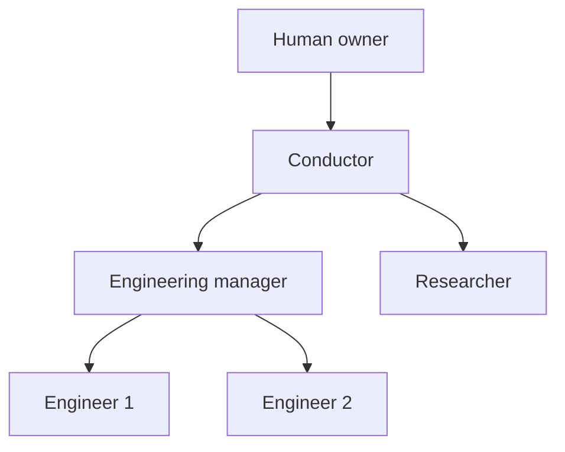
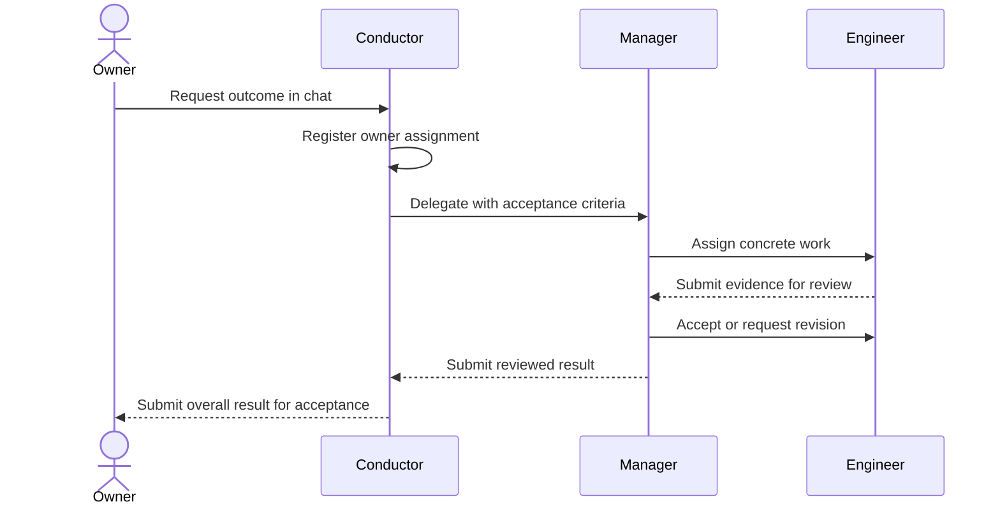

# Org Chart and Guardrails

Give an owner a team of persistent specialists whose roles determine what they
can do and whose reporting relationships determine where they delegate work.
The owner should be able to ask the conductor to build something in chat and
watch the team work, without copying the request into a separate task form.

This proposal accompanies the executable organization prototype in open
PR [#10595](https://github.com/kirodotdev/KiroCrew/pull/10595); the implementation
is not on main. The owning runtime contract is
[crew-mode](../system-specs/modules/crew-mode.md).
The prototype has one reporting tree, four fixed roles, bounded hiring, private
member memory, tracked assignments and explicit review. Custom roles, editable
permission policies and automatic workspace isolation are future work.

## The problem

A named agent template can describe an engineer or a conductor, but a prompt
alone does not require delegation. A broadly empowered conductor can complete
the whole task itself. Starting temporary subagents gives parallel execution
without necessarily retaining the same workers, memory or accountability.

Owners need to distinguish three things:

- A **role** defines responsibilities and the tools available to perform them.
- A **member** is a persistent identity with a role, a manager, its own private
  memory and a continuing conversation.
- A **run** is one turn of that member. Ending the process or the turn does not
  delete the member or accept its assignments.

An **assignment** records who requested the work, who owns it, its parent,
acceptance conditions, evidence and review decision.
Progress reports wake the assigning member as well as completion reports, so
an intermediate milestone can request the manager's attention while the larger
assignment remains open. Repeated reports share one queued wake.

## The owner experience

Agent Capabilities → Org Chart and Guardrails has four views:

| View | What the owner controls or inspects |
|---|---|
| Org chart | Create members, inspect reporting relationships, open conversations, move idle members and retire them |
| Guardrails | Read the four fixed role limits |
| Staffing | Set report allowances and simultaneous delegated turns |
| Work and messages | Assign work, inspect reports, send messages and accept or return completed work |

The member editor exposes the same organization surface, focused on the selected
member, and labels the controls that affect the whole team. Staffing saves apply
those limits immediately; the surrounding member settings have their own save.
Review decisions are visibly required, and retirement asks for confirmation
naming the affected member. Members outside the organization remain ordinary
Crew Members.
The member summary shows recent assignments, direct reports and their latest
team turns, with links to each report's conversation. Its wake sources include
the organization inbox, including the paused state.

Each arrow is a reporting relationship. Organization messages travel in both
directions along that relationship. Siblings coordinate through their manager.
The owner can open a direct conversation with any member.

The owner can say, “Build the engine we discussed.” The member reads its inbox,
registers the request with `org_start_task`, and uses the returned task ID to
work or delegate immediately. The gateway records the owner as the assigning
party and the calling member as the recipient. An engineer receiving the same
kind of request can implement it directly under its engineer permissions.

Only a live owner chat turn permits this registration. The tool accepts the
title and acceptance conditions, not an owner identity, recipient override or
permission token. Repeated calls in the same turn return the same task. A later
chat request is a separate turn; the member should continue an existing
assignment when the request is already tracked.

Direct chat does not change the member's manager or tools. Editing the
requirements of an existing assignment from chat, with automatic notification
to its manager, is a separate proposed feature.

## What each role can do

| Role | Available work | Required restriction |
|---|---|---|
| Conductor | Plan, hire reports, delegate, inspect evidence, review and communicate | No implementation writes or general shell |
| Manager | Decompose assignments, hire engineers or researchers, delegate and review | No implementation writes or general shell |
| Engineer | Read, edit, execute checks, report and use private memory | No hiring, policy changes or self-acceptance |
| Researcher | Read, browse, report findings and use private memory | No implementation writes or general shell |

Every role can register an owner request from its live chat. The role limits are
compiled into the member's agent configuration; the selected tools and fixed
reporting rules enforce the delegation pattern. Coordinators must accept
delegated work before submitting their own assignment as done.

This is an action boundary, not an attempt to police model reasoning. A
conductor can think about implementation and read code. It cannot obtain an
engineer's shell through a message or by hiring an engineer. Delegation starts
the recipient under its own identity, private memory and role tools.

The role ceiling is separate from tool approval and assignment acceptance.
Allowing an engineer's tools to run unattended does not accept its result.
Existing installation governance and OS protections continue to apply.

Task instructions such as “do not browse for this project” remain instructions
unless an existing installation policy independently enforces them. The
prototype does not offer per-assignment network policies, custom role editing
or arbitrary capability matrices.

## Hiring without losing continuity

`org_hire` first looks for an eligible idle direct report. Open assignments or a
pending turn make a member busy. If no report is available, the gateway reserves
a place within the manager's limit and provisions a new private member.
Reservation and capacity admission are atomic.

Staffing limits apply independently to each manager. Two managers allowed three
engineers each can have six engineers, but raising a limit does not create
them. Headcount and simultaneous delegated execution are separate settings.
Each member runs at most one conversation turn at a time.

The runtime delivers assignments into the recipient's persistent conversation.
It starts or resumes that member's own model session with its role tools.
The conductor and manager delegate through the organization; an engineer or
researcher executes the assigned work in its own conversation. This prototype
does not launch a separate `session_create` worker for every assignment. Generic
worker dispatch instructions are withheld from these guarded conversations.

Another engineer receives a new private store; it does not inherit an existing
engineer's private memory. Members share knowledge deliberately through reports,
messages and project artifacts. Shared project files are not private channels.
The prototype does not create separate worktrees for concurrent engineers:
managers must coordinate file ownership and integration order.
Use an existing project subdirectory inside a configured workspace. Private
memory isolation seals administrative workspace roots, including roots declared
by another known data home; it preserves writable project subdirectories.

## Work, evidence and review

An agent's `done` report puts its assignment into review. Only the assigning
party can accept it. A coordinator cannot finish while delegated work remains
unresolved. The owner reviews a task assigned directly to a member, even when
that member has a manager elsewhere in the tree.

Task bodies, reports, files and web pages are attributed data. They cannot
change the gateway-resolved caller identity or rewrite the organization policy.
The organization API derives a member from its verified private session;
internal tools cannot use the owner management endpoint.

### Relationship to the existing work ledger

The [conductor work ledger](rfc-conductor-work-ledger.md) already records
assignments, reports, evidence and decisions. It also supports a worker becoming
a second-level conductor. Those concepts overlap deliberately; a second store
needs a reason beyond different names.

Four existing contracts prevent using its current APIs for persistent members:

| Contract | Existing work ledger | Persistent organization |
|---|---|---|
| Worker lifetime | The HTTP bind route permits one dispatch per child session, ever; even a closed item cannot be rebound through the API | A member keeps one conversation across successive assignments and can have several open assignments |
| Assignment authority | Binding requires a live `session_create` child whose `_created_by` is the assigning conductor, in the same workspace | Authority comes from the verified private member and its manager/report relationship; the owner can also assign directly |
| Report addressing | `work_brief` and `work_report` derive the only item from the caller's binding; the worker cannot choose an item | The inbox exposes authorized assignments and a report names the assignment it updates |
| Delivery transaction | `work_report` writes records for the conductor to read; it deliberately does not enqueue a prompt | Assignment, report or message changes commit together with a coalesced wake; run claims and completion survive gateway restarts |

These are enforced in `dashboard/handlers/work_ledger.py`, `work_ledger.py` and
`mcp_work.py`, not merely conventions in a conductor prompt. Adapting them would
require changing session ownership, one-item addressing and delivery semantics
together. Storing a second copy of an assignment in each ledger would instead
introduce two authorities and a cross-store recovery problem.

The prototype therefore keeps one authoritative organization assignment record
alongside relationships, staffing and wake state. It reuses the existing
`kirocrew-work` MCP server, strict caller authentication and member conversation
runtime. Its `org_inbox`, `org_assign`, `org_report`, `org_review` and `org_retry`
tools expose member-scoped operations; the existing `work_*` tools retain their
child-session contract. Consolidation would need an explicit migration contract
for those four differences, rather than widening the current tools implicitly.

## Delivery and interruption

The gateway persists assignments, messages and wake requests before confirming
the operation. Pending wakes for one member coalesce. Reports on delegated work
wake the assigning manager, and members waiting on reports end their turns.
The scheduler waits while the owner is already talking to a member.

Pause prevents new delegated turns from starting. Cancelling a task closes it
and its open descendants; it neither rolls back side effects nor stops an
already running turn. The conversation retains its existing Stop control.

Orderly shutdown drains a member conversation before returning a wake whose
provider turn was never accepted. That work remains queued. After an abrupt
stop, an in-flight run becomes interrupted; accepted work is never replayed
automatically. The system preserves its identity and evidence and requires a
deliberate retry whenever side effects are uncertain. It cannot assume that an
external action failed merely because completion was not recorded.
Agent-requested retries are bounded; the owner can inspect and retry repeated
failures.

Moving or retiring a busy member is refused. A manager must resolve its active
reports before retirement. Retirement preserves identity, private memory and
history. Organization-aware renaming, role changes, comprehensive crash
reconciliation and an organization-wide emergency stop remain future work.

## Validation scenario: build a chess engine

A substantial validation starts with an owner chat request to build a chess
engine from scratch. The conductor delegates through a manager to several
engineers, with agreed interfaces and separate file ownership:

1. Board representation, legal move generation and perft checks for ordinary
   positions, castling, en passant and promotion.
2. Iterative deepening, alpha-beta search, quiescence, evaluation, move ordering
   and time management.
3. A UCI interface and a standard-library match harness.

An engineer compiles the engine and runs the matches. A researcher independently
reads the saved evidence, checks the settings and score, and reports its review.
This respects the researcher's lack of shell access.

The acceptance target is a score of at least 50% over 100 completed games
against Stockfish with `UCI_LimitStrength=true` and `UCI_Elo=1500`, alternating
colors with identical recorded time controls. Score means
`(wins + draws / 2) / games`. Stockfish serves only as opponent and perft
reference; it must not select the custom engine's moves.

Evidence must include source and build instructions, exact perft comparisons,
opponent version and options, executable hashes, complete move records,
per-game outcomes and the aggregate score. Crashes, illegal moves and timeouts
are failures. A run that starts, or a member that says “done,” is insufficient
evidence of success.

### Observed prototype run: 13 September 2026

A supervised run met the match target. The conductor delegated through one
manager to three persistent engineers; a researcher reviewed the saved evidence.
The engineers implemented the engine in C++17 and the match driver with Python's
standard library. The final games ran in disjoint allocations of 34, 34 and 32,
with the same frozen binaries and continuous color alternation.

| Measurement | Observed result |
|---|---|
| Opponent | Official Stockfish 11, `UCI_LimitStrength=true`, `UCI_Elo=1500` |
| Time control | 300 ms per move for both engines; one thread, no pondering |
| Completed games | 100, with unique global game numbers and 50 games per color |
| Wins / draws / losses | 74 / 7 / 19 |
| Score | 77.5 points out of 100 |
| Recorded errors | 0 |
| Independent move replay | All 8,306 plies legal; all terminal results verified |

The saved perft report matched the initial position through depth 6
(119,060,324 nodes), Kiwipete through depth 4, and the en-passant and promotion
reference positions through depth 5. A separate verifier replayed every saved
move through Stockfish's depth-1 perft interface and checked the final
checkmates, repetitions and insufficient-material draw. That verification used
Stockfish only to check recorded moves and positions.

The engine SHA-256 was
`503b9d47ed94aad4f3aab93f3b6ba28f116892913b526a631ea0a16e65bcf7f3`;
the opponent SHA-256 was
`d44ee3d6506aeeaa2464989f363981cfa12400741ad0cd206742b7c0adc4d8bf`.
Stockfish 11 was built from its official source tag because the downloaded newer
binary required a newer glibc than the validation host. The measured score
applies to this version and time control.

Owner intervention was needed to select a writable project child, request
match-harness corrections, recover missing perft evidence and choose parallel
match allocations. A progress report also exposed a missing manager wake; the
prototype now wakes the assigning member on progress as well as completion.
The PR's media and verification report should distinguish this supervised build
from subsequent demonstrations of the final revision.

## Scope and release decisions

The implementation uses Crew's existing member conversations, private memory,
provider startup and OS sandbox. The organization records are gateway-owned
and hidden from member processes. Roles require the Kiro backend and the
existing private-memory execution boundary; unsupported runtimes refuse.

The first release should be judged on unauthorized successful actions, lost
actionable work, duplicated dispatches, peak admitted concurrency, recovery
behavior and owner interventions per accepted assignment. Cost and throughput
claims need measured workloads.

The next product decisions are whether the starter team always needs a
manager, which additional research or reviewer permissions are useful, and
how much policy customization to expose. A general communication graph,
multiple managers per member, automatic memory sharing and broad execution
backend support require separate authority and validation contracts.
