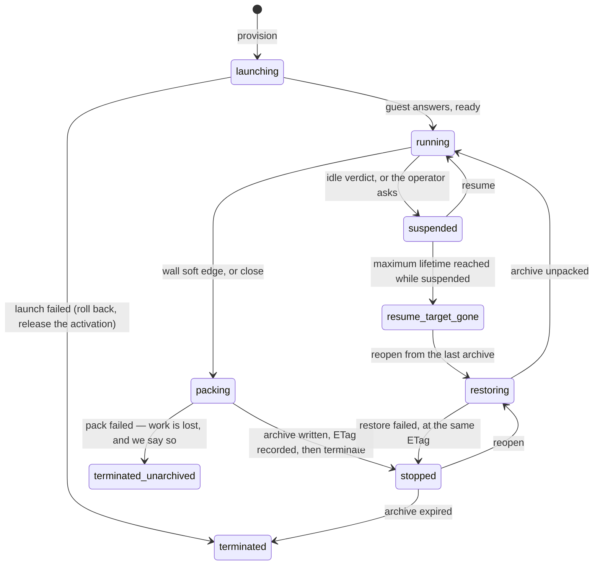

# RFC: Remote Instance on Lambda MicroVM

> **Nothing built.** Measured claims about Kiro Crew are read at `fcee47347`.
> AWS behaviour is cited to public documentation. The design restates decisions
> established by an internal prototype built by the DevExAI team, which ran Kiro
> Crew's published container image on Lambda MicroVMs; no code is carried over.

## Summary

**Bring Lambda MicroVM into Kiro Crew and consolidate it with our existing
Fargate deployment method.**

A remote crew becomes a MicroVM instead of an ECS task. The lane keeps every
piece of the Fargate lane that is not about ECS — the `LaunchEngine` seam, the
launch job's step machine and rollback, the instances registry, the SSM tunnel,
the dashboard — and adds the one thing Fargate has no equivalent for: a crew
that **suspends when nobody is using it** and resumes with its memory and disk
intact ([Suspending and resuming MicroVMs](https://docs.aws.amazon.com/lambda/latest/dg/microvms-launching.html)).

That single capability is the whole case. A Fargate task bills for every hour it
exists; a developer uses a crew for a fraction of them.

## 1. Motivation

A remote crew is used in bursts and idle the rest of the day, and Fargate has no
way to express that. `StopTask` is the only way to stop paying, and it destroys
the crew's state, so in practice a Fargate crew is left running and billed for
730 hours a month.

Lambda MicroVMs price running time per second and suspended time as snapshot
storage only. AWS's own pricing page works the arithmetic for a use case that is
ours almost exactly — a per-developer sandboxed Linux environment used 2.5 hours
of an 8-hour day, suspending in between — and arrives at **$12.41 per developer
per month** ([Lambda pricing, MicroVMs, Pricing Example 1](https://aws.amazon.com/lambda/pricing/)).

## 2. Goals and non-goals

**Goals.** Launch a remote crew on a MicroVM through the existing `LaunchEngine`
seam. Suspend an idle crew and resume it with its state. Survive the platform's
fixed maximum lifetime without losing the crew's work. Make the whole lifecycle
testable with no AWS account.

**Non-goals.** Removing the Fargate lane — it stays configured, offered and
supported. Any second principal: a crew still belongs to whoever launched it.
Moving or deleting Fargate code: the shared parts are extracted later (§7).
Multi-user rosters, per-crew IAM roles, and any AWS-hosted control plane.

## 3. Design

### What the Fargate lane already gives us, unchanged

| Reused | Why it is lane-neutral |
|---|---|
| `LaunchEngine` protocol, `cloud/launch_job.py` | Five methods, two implementations today; this is a third |
| `run_launch`'s step machine, rollback and orphan reaping | Durable across a gateway restart; knows nothing about compute |
| Device-code sign-in and the progress UI | Driven from the job, not the backend |
| Instances registry and the SSM tunnel | A MicroVM registers as an SSM managed node; `instances/validation.py`'s `_SSM_TARGET_RE` already accepts that id shape, and `cloud/ssm.py`'s `build_port_forward_argv` is deliberately lane-blind |
| The crew runtime image and the signed crew bundle | Same two inputs the Fargate lane builds from; only the build target differs -- Fargate pushes to a registry and registers a task definition, this lane zips the same recipe and has Lambda build it |
| Everything downstream of "the crew is a reachable instance" | The remote-instance pane, federated session search, the fenced proxy route, and remote turn execution all already work against a managed node |

So the lane's job is to produce a managed node and manage its life. Nothing
above the seam learns that a third backend exists.

### What is new

1. **A `CrewLifecycle` port beside `LaunchEngine`** — `suspend`, `resume`,
   `pack`, `poll`. `LaunchEngine` has no verb for any of these, and widening it
   would change a protocol the EC2 and Fargate lanes implement. A separate port
   leaves both untouched.
2. **Idle suspend, decided by the gateway.** The platform measures idle as
   inbound traffic on the VM's endpoint. A crew reached through an SSM tunnel
   generates none, so the platform's own idle policy would suspend a crew in the
   middle of a turn. The lane therefore disables that policy and computes the
   verdict itself: **no running chat slot and idle for 15 minutes.**
3. **Pack and restore.** Suspend preserves state only while the VM exists, and
   the VM's lifetime is bounded, so durable state needs a second mechanism. Pack
   writes a tar of the crew home to S3 under a conditional write
   (`If-None-Match` on the first pack, `If-Match` on every later one) and keeps
   the returned ETag; restore unpacks it into a fresh crew home on reopen. A
   failed precondition means two writers raced for one crew's archive and is
   never retried. The archive carries both session halves, the session map,
   uploads, artifacts, memory, skills, crons, lessons and settings — and
   excludes the embedding model, which is three orders of magnitude larger than
   everything else put together and is refetched on boot. Archives expire after
   14 days.
4. **A wall watchdog inside the guest.** A MicroVM's maximum lifetime is 28,800
   seconds, covering running *and* suspended time, and is not adjustable. The
   guest arms its own soft-pack timer at 7 h 30 m and a hard stop at 7 h 40 m
   from its launch payload, so a laptop that goes to sleep delays the ledger
   rather than costing the user their crew. The gateway's timer is a backstop,
   not the mechanism.
5. **A hand-deployed base template**, `kirocrew-microvm-base.yaml`, alongside
   today's `kirocrew-fargate-base.yaml`. It owns the archive bucket and its KMS
   key, the recipe bucket an image build reads from, and the two roles the lane
   passes. `provision` never creates a bucket, a key or a role.
6. **A `microvm` provisioner registered conditionally**, from a complete
   `microvm` block in the operator's `cloud.json`, mirroring how
   `FargateConfig.is_complete` gates the Fargate row. A lane offered without a
   placement, a pinned image and a secret is a lane that rejects every launch.
7. **A crew's image is BUILT, not chosen, from the same inputs Fargate builds
   from.** An AWS-managed base plus that crew's own signed, deny-by-default
   bundle, uploaded as a recipe zip for Lambda to build. The only difference
   between the lanes is the build target: Fargate pushes to a registry and
   registers a task definition; this one calls `CreateMicrovmImage`. Neither the
   bundle format nor the restore-the-mate path is written a second time.

   Images are cached by a digest of their two inputs, and the digest IS the
   image's name. Keying on the inputs is what makes the cache safe to trust: a
   name that merely labels a build says nothing about content, so a lookup
   against it can serve the wrong image, while a lookup against the digest either
   matches the content or finds nothing. An image that exists with no ACTIVE
   version is a miss, not a hit -- a finished build that produced nothing a launch
   can use.

   Because the guest therefore runs the front listener, **per-crew-secret auth on
   every one of its routes ships with this lane rather than after it.** On a lane
   bounded by a private subnet and a security group that is a tightening; on one
   whose compute carries its own internet-reachable endpoint it is the boundary.

### Lifecycle

A `running` or `suspended` crew the gateway has not heard from recently is
reported as **unknown**. That is derived from how stale the last observation is,
never stored, because the honest answer to "is it up?" after a partition is "I
do not know".

Three orderings are load-bearing and are design, not implementation detail.
`terminate` is the **last** step of a pack, because the platform delivers no
termination signal the guest can use to finish writing. The ETag is recorded
**before** the terminate, because an archive whose ETag the gateway never
learned cannot be restored. A restore that fails returns to `stopped` **at the
same ETag**, so the next pack cannot overwrite a good archive with an empty
home.

## 4. Cost

All figures US East (N. Virginia), Graviton, from the public pricing pages. A
MicroVM's baseline is set on its image and scales vertically to 4x on demand
([MicroVM sizing](https://docs.aws.amazon.com/lambda/latest/dg/microvms-images.html));
`src/kiro_crew/cloud/sizes.py` documents a crew's working set at 16 GB and up,
so the lane's shape is the 4 GB or 8 GB baseline, not the 2 GB default.

| | Fargate, always on | MicroVM, 2.5 h/day |
|---|---|---|
| Billed hours per developer-month | 730 | ~50 running, the rest suspended |
| Running rate, small shape | — | **$0.126/h** (2 GB / 1 vCPU) |
| Running rate, crew shape | $0.373/h (8 vCPU / 32 GB) | $0.504/h (8 GB / 4 vCPU baseline) |
| Suspended rate | no such state | **$0.0002/h** (2 GB), $0.0009/h (8 GB) |
| Per developer-month, small shape | — | **$12.41** (AWS's own worked example) |
| Per developer-month, crew shape | ~$272, or ~$545 at 16 vCPU / 64 GB | ~$50, including peak scaling and snapshot I/O |

The rate per running hour is **higher** on a MicroVM. The saving is entirely in
the hours: roughly 50 billed instead of 730. Any change that keeps a crew
running while nobody is using it gives the whole saving back, which is why §3's
idle verdict is a correctness requirement and not a tuning knob.

## 5. Security considerations

**Every route reachable through the VM's endpoint authenticates its caller.**
This is the one requirement the lane adds, and it is a precondition rather than
a feature. On Fargate a security group decides who can reach a task; a MicroVM's
HTTPS endpoint is public, reachable from the internet, and the only enforced
scoping on an endpoint token is the port list it names. The lane's own
authentication is therefore the entire boundary. A platform lifecycle hook that
cannot carry a header answers a fixed reply that reads nothing and discloses
nothing. No liveness or index route is reachable unauthenticated.

**The control secret travels by reference, never by value.** It lives in Secrets
Manager at a per-crew path; the launch payload carries only its ARN. The payload
is an argument to an AWS API call and may persist in request history, and AWS
does not document whether that field is treated as sensitive, so we assume it is
not.

**Inside the VM the crew runs unsandboxed, deliberately.** `kiro-cli` sandboxes
the model subprocess in an unprivileged user namespace, and the crew container
cannot get one. The Fargate RFC accepted this with an operator-stated
`internal_only` claim, and named a Firecracker-based runtime as the real
containment it was standing in for. A Lambda MicroVM **is** that runtime: the
boundary is the virtual machine, not a namespace inside it. The lane therefore
sets the unsandboxed flag as a stated consequence of the VM boundary. The
exposure accepted is the same one stated there and is not narrowed: a
prompt-injected worker on this VM can reach the crew's model credential, and the
blast radius is the owner's own account and their own crew.

**One owner.** Nothing here makes a crew reachable by anyone but whoever
launched it, and no decision above should be read as leaving room for a second
caller.

## 6. Testing

The lane is testable with **no AWS account**, which is a design constraint, not a
convenience. Three layers:

- **Data plane:** `moto` in server mode on loopback for S3, Secrets Manager and
  parameters — server mode rather than in-process, because the guest and the
  control plane are different processes. It enforces the conditional-write
  preconditions the pack depends on, so a pack conflict is a real 412. A guard
  test asserts that, so a dependency bump cannot turn the conflict tests
  green-but-empty.
- **Guest:** a `LocalLaunchEngine` behind the same port as the real one —
  `docker run` to launch, `pause` to suspend, `unpause` to resume, `rm -f` to
  terminate — reached on a loopback port instead of a tunnel. A full
  launch → turn → suspend → resume → pack → terminate → restore → verify cycle
  runs in about 25 seconds.
- **Control plane:** a loopback fake, driven by the real AWS client so the
  request shapes are validated by the installed service model rather than by the
  fake. A contract test reads that model and fails the day an SDK bump changes
  the API.

**What a local harness cannot establish, stated as a ceiling rather than left
implicit:** provisioning latency and capacity pressure; the real maximum
lifetime and the platform-initiated terminate at its edge; the idle policy's own
auto-suspend and auto-resume *trigger* (the handling is testable, the trigger is
not); the public endpoint, its TLS, and the ingress connector; endpoint token
semantics; the image build; the SSM activation and tunnel; and the sandbox and
cgroup ceilings a container cannot enforce. Each needs a team test account, and
none of them is on the path to a first merge.

## 7. Out of scope, and follow-ups

- **A second bundle format or restore path.** The image is built from the SAME
  signed, deny-by-default crew bundle the Fargate lane already produces, and the
  mate reaches the VM through this lane's own restore path. Writing either a
  second time is the drift to avoid, not work to schedule.
- **Skipping SSM.** If the remote-instance transport could accept a MicroVM
  endpoint and a port-scoped token, the activation, the managed node, its role
  and two sweeper classes all disappear. This is the largest simplification
  available and it is a new transport, not a config change.
- **Extracting the shared helpers from the Fargate lane.** Lifetime and
  population bounds, the sweep planner, the ownership classifier and the
  teardown planner are all lane-shaped rather than ECS-shaped, and a second lane
  would reimplement them badly. Extraction is its own PR so that this lane's
  review is about this lane.
- **A multi-user roster.** Per-crew IAM roles, a shared fleet view and a cached
  session snapshot for unreachable crews are all answers to questions a
  single-owner lane does not ask.

## 8. Open questions

- **Whether the archive is the right durability unit at all**, or whether this
  lane should ride the durable-transcript work ([#13374](https://github.com/kirodotdev/KiroCrew/issues/13374))
  rather than become a second writer of the same files.
- **Whether a lane renderer is needed for a first merge.** No renderer claims
  the Fargate lane today, which is why it is API-reachable and absent from the
  picker. A MicroVM lane that names a credential recipient also needs the
  frontend to send that field, which nothing does at `fcee47347`.
- **What surface receives a pack conflict.** With one gateway it should be
  impossible, so it is a bug report rather than a notification — but it needs a
  destination before the first launch.
- **Whether the crew shape fits.** The largest MicroVM baseline peaks at 32 GB
  and 16 vCPU, which matches our Power tier's vCPU count but not its memory.
  Whether a crew is comfortable at that ceiling is a measurement, not a
  judgement, and it belongs to the first lane that runs against a real account.
